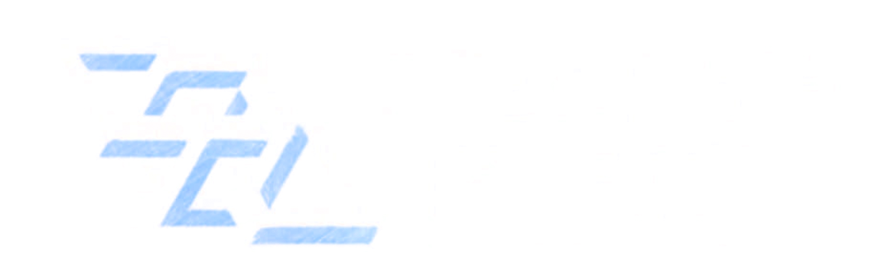
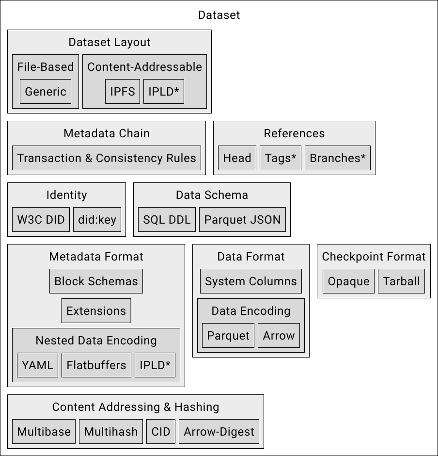
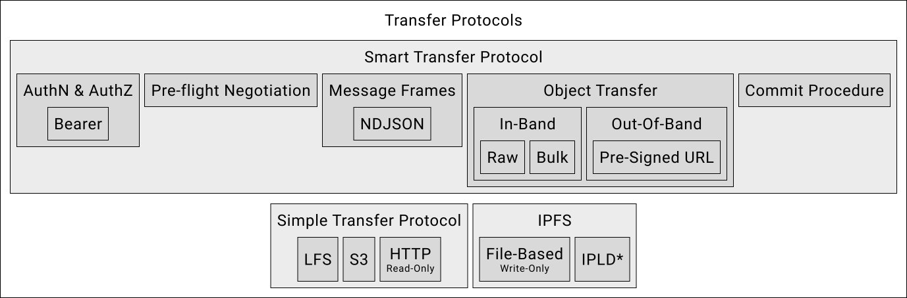

<strong>Open protocol for multi-party exchange and collaborative processing of data</strong>

[Website](https://opendatafabric.org) |
[Reference Implementation](https://github.com/kamu-data/kamu-cli) |
[Original Whitepaper](https://arxiv.org/abs/2111.06364) |
[Chat](https://discord.gg/nU6TXRQNXC)

## Introduction
[Open Data Fabric](https://opendatafabric.org) (ODF) is an open protocol specification for decentralized exchange and transformation of semi-structured data, that aims to holistically address many shortcomings of the modern data management systems and workflows.

<i>Introductory video</i>

The goal of this specification is to develop a method of data exchange that would:
- Enable worldwide collaboration around data cleaning, enrichment, and derivation
- Create an environment of verifiable trust between participants without the need for a central authority
- Enable high degree of data reuse, making quality data more readily available
- Improve liquidity of data by speeding up the data propagation times from publishers to consumers
- Create a feedback loop between data consumers and publishers, allowing them to collaborate on better data availability, recency, and design

ODF protocol combines four decades of evolution in enterprise analytical data architectures with innovations in Web3 cryptography and trustless networks to create a decentralized data supply chain that can provide timely, high-quality, and verifiable data for data science, AI, smart contracts, and applications.

## Quick Summary
At a bird's eye view, ODF specifies the following aspects of data management, with every subsequent layer building tightly upon previous:

### Data Format
- **Parquet** columnar format is used for efficient storage of raw data
- **Event streams** (not tables) as logical model of a dataset, with focus on supporting high-frequency real-time data
- All data forms an **immutable ledger** - streams evolve only by appending new events
- Retractions & corrections are explicit - full history of evolution of data is preserved by default
- **Storage agnostic** layout based on blob hashes adds support for decentralized content-addressable file systems

### Metadata Format
- Metadata format is extensible and records all aspects of dataset lifecycle: from creation and identity, to adding raw data, and to licensing, stewardship, and governance
- Metadata is organized into cryptographic ledger (similar to git history or a blockchain) to keep it tamper-proof
- Block hash of the metadata ledger serves as a stable reference to how dataset looked like at a specific point in time (Merkel root)
- Maintenance operations on metadata include compactions, history pruning, indexing etc.

### Identity, Ownership, Accountability
- W3C [DIDs](https://www.w3.org/TR/did-1.0/) are used to uniquely identify datasets on the network - they are an irrevocable part of the metadata chain
- DIDs likewise identify actors: data owners, processors, validators, replicators...
- DID key signing chains are used to **prove ownership** over datasets in a decentralized network
- Metadata blocks support actor signatures to assign **accountability**

### Data Transfer Protocols
- ODF "nodes" that range from CLI tools to analytical clusters can exchange data using a set of protocols
- "Simple transfer protocol" is provided for maximal interoperability
- "Smart transfer protocol" is provided for secure yet highly efficient direct-to-storage data replication

### Processing & query model
- **Derivative data** *(i.e. data created by transforming other data)* is a first-class citizen in ODF
- **Stateful temporal/stream processing** is used as the core primitive in ODF to create **derivative data pipelines** (Kappa architecture) that are highly autonomous and near-zero maintenance
- All derivative data is **traceable, verifiable, and auditable**
  - No matter how many hands and transformation steps data went through - we could always tell where every bit came from, who processed it, and how
- **Verifiable computing techniques** are extended to work with temporal processing via:
    - Determinism + Reproducibility
    - Zero-Knowledge (TEEs, FHE, MPC, Zk proofs)
- **Verifiable querying** - allows to accompany every query result with a reliable proof that it was executed correctly, even when processing is done by an unreliable 3rd party
- **Abstract engine interface** spec allows easily adding new engine implementations as plug-ins.

### Dataset Discovery
- Global, permissionless, censorship-proof dataset registry is proposed to advertise datasets (blockchain-based)

### Privacy & Access Control
- Node-level ReBAC permission management
- Dataset **encryption** - allows exchanging private data via open non-secure storage systems
- Key exchange system (smart contract) is proposed to facilitate negotiating access to encrypted private data
- Advanced encryption schemes can be used to reveal only part of the full dataset history, enabling e.g. latency-based monetization schemes. 

### Federated Querying
- Thanks to DIDs and content-addressability, the queries and transformations in ODF can express *"what needs to be done"* without depending on "where data is located"
- ODF nodes can form ad hoc peer-to-peer networks to:
  - Execute queries that touch data located in different organizations
  - Continuously run cross-organizational streaming data processing pipelines
- The verifiability scheme is designed to swiftly expose malicious actors.

## Introductory materials
- [Original Whitepaper (July 2020)](https://arxiv.org/abs/2111.06364)
- [Kamu Blog: Introducing Open Data Fabric](https://www.kamu.dev/blog/introducing-odf/)
- [Talk: Open Data Fabric for Research Data Management](https://www.youtube.com/watch?v=Ivh-YDDmRf8)
- [PyData Global 2021 Talk: Time: The most misunderstood dimension in data modelling](https://www.youtube.com/watch?v=XxKnTusccUM)
- [Data+AI Summit 2020 Talk: Building a Distributed Collaborative Data Pipeline](https://databricks.com/session_eu20/building-a-distributed-collaborative-data-pipeline-with-apache-spark)

More tutorials and articles can be found in [kamu-cli documentation](https://docs.kamu.dev/cli/learn/learning-materials/).

## Current State
The specification is currently in actively evolving and welcomes feedback.

See also our [Roadmap](https://github.com/kamu-data/open-data-fabric/projects/1) for future direction and [RFC archive](/rfcs) for the record of changes.

## Known Implementations
`Coordinator` implementations:
- [kamu-cli](https://github.com/kamu-data/kamu-cli/) - data management tool that serves as the reference implementation.

`Engine` implementations:
- [kamu-engine-spark](https://github.com/kamu-data/kamu-engine-spark) - engine based on Apache Spark.
- [kamu-engine-flink](https://github.com/kamu-data/kamu-engine-flink) - engine based on Apache Flink.
- [kamu-engine-datafusion](https://github.com/kamu-data/kamu-engine-datafusion) - engine based on Apache DataFusion.
- [kamu-engine-risingwave](https://github.com/kamu-data/kamu-engine-risingwave) - engine based on RisingWave.

## History
The specification was originally developed by [Kamu](https://kamu.dev) as part of the [kamu-cli](https://github.com/kamu-data/kamu-cli/) data management tool. While developing it, we quickly realized that the very essence of what we're trying to build - a collaborative open data processing pipeline based on verifiable trust - requires full transparency and openness on our part. We strongly believe in the potential of our ideas to bring data management to the next level, to provide better quality data faster to the people who need it to innovate, fight diseases, build better businesses, and make informed political decisions. Therefore, we saw it as our duty to share these ideas with the community and make the system as inclusive as possible for the existing technologies and future innovations, and work together to build momentum needed to achieve such radical change.

## Contributing
See [Contribution Guidelines](./CONTRIBUTING.md)

## RFC List
- [RFC-000: RFC Template](rfcs/000-template.md)
- [RFC-001: Record Offsets](rfcs/001-record-offsets.md)
- [RFC-002: Logical Data Hashes](rfcs/002-logical-data-hashes.md)
- [RFC-003: Content Addressability](rfcs/003-content-addressability.md)
- [RFC-004: Metadata Extensibility](rfcs/004-metadata-extensibility.md)
- [RFC-005: New Annotation Metadata Events](rfcs/005-dataset-annotations.md)
- [RFC-006: Store Checkpoints as Files](rfcs/006-checkpoints-as-files.md)
- [RFC-007: Simple Transfer Protocol](rfcs/007-simple-transfer-protocol.md)
- [RFC-008: Smart Transfer Protocol](rfcs/008-smart-transfer-protocol.md)
- [RFC-009: Ingest Source State](rfcs/009-ingest-source-state.md)
- [RFC-010: Data Schema in Metadata](rfcs/010-data-schema-in-metadata.md)
- [RFC-011: Push Ingest Sources](rfcs/011-push-ingest-sources.md)
- [RFC-012: Recommend `base16` encoding for textual representation of hashes and DIDs](rfcs/012-recommend-base16-encoding.md)
- [RFC-013: Enum representation in YAML encoding](rfcs/013-yaml-enum-representation.md)
- [RFC-014: Minimizing scanning for last offset and block ](rfcs/014-minimize-offset-scanning.md)
- [RFC-015: Unified changelog stream schema](rfcs/015-unified-changelog-stream-schema.md)
- [RFC-016: ODF schema format](rfcs/016-odf-schema.md)
- [RFC-017: Large files linking](rfcs/017-large-files-linking.md)
