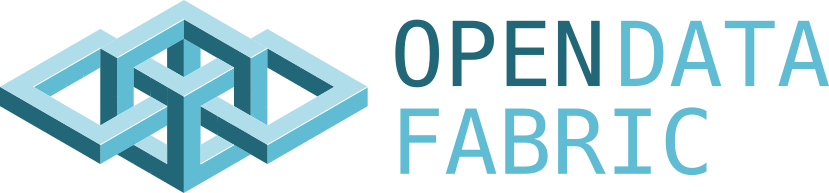
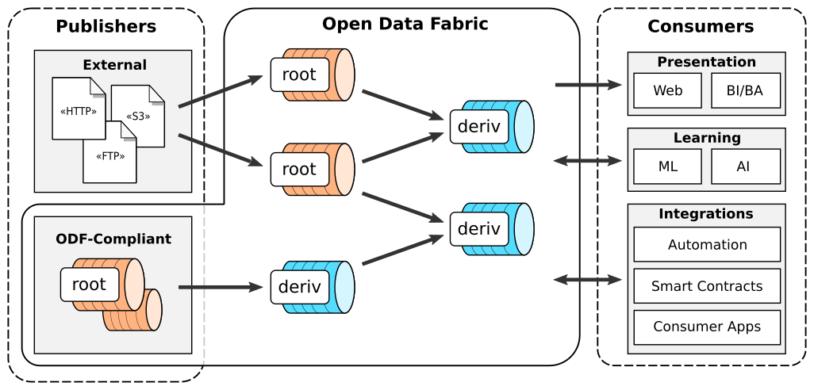
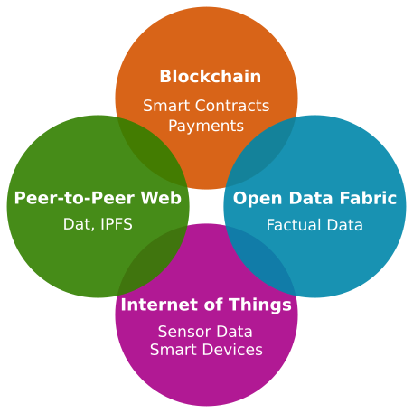

<strong><i>Open protocol for decentralized exchange and transformation of data</i></strong>

[Website](https://docs.kamu.dev/odf/) |
[Original Whitepaper](https://arxiv.org/abs/2111.06364) |
[Reference Implementation](https://github.com/kamu-data/kamu-cli) |
[Chat](https://discord.gg/nU6TXRQNXC)

## Introduction

**Open Data Fabric** is an open protocol specification for decentralized exchange and transformation of semi-structured data, that aims to holistically address many shortcomings of the modern data management systems and workflows.

The goal of this specification is to develop a method of data exchange that would:
- Enable worldwide collaboration around data cleaning, enrichment, and derivation
- Create an environment of verifiable trust between participants without the need for a central authority
- Enable high degree of data reuse, making quality data more readily available
- Improve liquidity of data by speeding up the data propagation times from publishers to consumers
- Create a feedback loop between data consumers and publishers, allowing them to collaborate on better data availability, recency, and design

`ODF` protocol is a **Web 3.0 technology** that powers a distributed structured data supply chain for providing timely, high-quality, and verifiable data for data science, smart contracts, web and applications.

### Introductory materials
- [Original Whitepaper (July 2020)](https://arxiv.org/abs/2111.06364)
- [Kamu Blog: Introducing Open Data Fabric](https://www.kamu.dev/blog/introducing-odf/)
- [Talk: Open Data Fabric for Research Data Management](https://www.youtube.com/watch?v=Ivh-YDDmRf8)
- [PyData Global 2021 Talk: Time: The most misunderstood dimension in data modelling](https://www.youtube.com/watch?v=XxKnTusccUM)
- [Data+AI Summit 2020 Talk: Building a Distributed Collaborative Data Pipeline](https://databricks.com/session_eu20/building-a-distributed-collaborative-data-pipeline-with-apache-spark)

More tutorials and articles can be found in [kamu-cli documentation](https://docs.kamu.dev/cli/learn/learning-materials/).

## Current State

The specification is currently in actively evolving and welcomes feedback.

See also our [Roadmap](https://github.com/kamu-data/open-data-fabric/projects/1) for future direction and [RFC archive](/rfcs) for the record of changes.

## Implementations

`Coordinator` implementations:
- [kamu-cli](https://github.com/kamu-data/kamu-cli/) - data management tool that serves as the reference implementation.

`Engine` implementations:
- [kamu-engine-spark](https://github.com/kamu-data/kamu-engine-spark) - engine based on Apache Spark.
- [kamu-engine-flink](https://github.com/kamu-data/kamu-engine-flink) - engine based on Apache Flink.

## History

The specification was originally developed by [Kamu](https://kamu.dev) as part of the [kamu-cli](https://github.com/kamu-data/kamu-cli/) data management tool. While developing it, we quickly realized that the very essence of what we're trying to build - a collaborative open data processing pipeline based on verifiable trust - requires full transparency and openness on our part. We strongly believe in the potential of our ideas to bring data management to the next level, to provide better quality data faster to the people who need it to innovate, fight deceases, build better businesses, and make informed political decisions. Therefore, we saw it as our duty to share these ideas with the community and make the system as inclusive as possible for the existing technologies and future innovations, and work together to build momentum needed to achieve such radical change.

## Contributing
See [Contribution Guidelines](./CONTRIBUTING.md)

## RFC List
- [RFC-000: RFC Template](rfcs/000-template.md)
- [RFC-001: Record Offsets](rfcs/001-record-offsets.md)
- [RFC-002: Logical Data Hashes](rfcs/002-logical-data-hashes.md)
- [RFC-003: Content Addressability](rfcs/003-content-addressability.md)
- [RFC-004: Metadata Extensibility](rfcs/004-metadata-extensibility.md)
