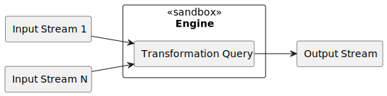
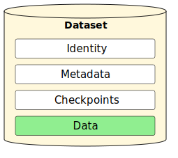
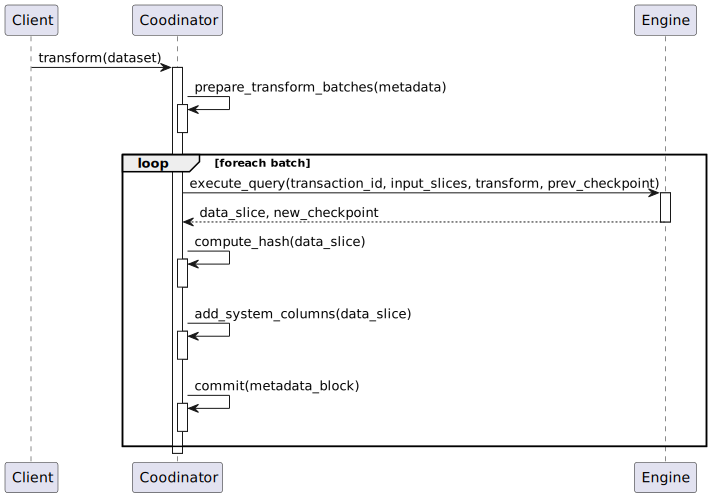

# Open Data Fabric

Version: 0.34.1

# Abstract
**Open Data Fabric** is an open protocol specification for decentralized exchange and transformation of semi-structured data that aims to holistically address many shortcomings of the modern data management systems and workflows.

# Problem Statement
Develop a method of semi-structured data exchange that would:
- Enable worldwide collaboration around data cleaning, enrichment, and transformation.
- Create an environment of verifiable trust between participants without the need for a central authority.
- Enable a high degree of data reuse, making quality data more readily available.
- Reduce the time it takes data to propagate from publishers to consumers.
- Introduce a feedback loop between the consumers and publishers of data that would facilitate improvements around data availability, recency, and design.
- Provide foundation for implementing data anonymization techniques to simplify and speed up the exchange of vital but sensitive data.

# Table of Contents

<!-- toc -->

- [Requirements](#requirements)
- [Scope](#scope)
- [Design Decisions](#design-decisions)
  * [Nature of Data](#nature-of-data)
  * [Nature of Transformations](#nature-of-transformations)
  * [Evolution of Data](#evolution-of-data)
  * [Data Sharing](#data-sharing)
  * [Transactional Semantics](#transactional-semantics)
- [Concepts and Components](#concepts-and-components)
  * [Event](#event)
  * [Data](#data)
  * [Schema](#schema)
  * [Offset](#offset)
  * [Operation Type](#operation-type)
  * [Data Slice](#data-slice)
  * [Metadata](#metadata)
  * [Metadata Chain](#metadata-chain)
  * [Dataset](#dataset)
  * [Query](#query)
  * [Engine](#engine)
  * [Checkpoint](#checkpoint)
  * [Coordinator](#coordinator)
  * [Ingestion](#ingestion)
  * [Merge Strategy](#merge-strategy)
  * [Hash](#hash)
  * [Provenance](#provenance)
  * [Verifiability](#verifiability)
  * [Time](#time)
  * [Watermark](#watermark)
  * [Retractions and Corrections](#retractions-and-corrections)
  * [Repository](#repository)
  * [Projection](#projection)
  * [Manifest](#manifest)
- [Specification](#specification)
  * [Dataset Identity](#dataset-identity)
  * [Data Format](#data-format)
  * [Schema Format](#schema-format)
  * [Common Data Schema](#common-data-schema)
  * [Representation of Retractions and Corrections](#representation-of-retractions-and-corrections)
  * [Metadata Format](#metadata-format)
  * [Dataset Layout](#dataset-layout)
  * [Engine Contract](#engine-contract)
  * [Coordinator Contract](#coordinator-contract)
  * [Repository Contract](#repository-contract)
  * [Future Topics](#future-topics)
- [Reference Information](#reference-information)
  * [Metadata Reference](#metadata-reference)
  * [Engine API Reference](#engine-api-reference)
  * [Repository API Reference](#repository-api-reference)

<!-- tocstop -->

# Requirements
Functional:
- **Complete historical account** - when data is used to gain insight and to drive decision-making discarding or modifying data is akin to rewriting history. The history of all data observed by the system must be preserved.
- **Reproducibility** - the ability to reproduce the results is a cornerstone of the scientific method without which the process and findings of one party cannot be verified by others. Therefore, we require that all the transformations performed within the system must be fully reproducible, and it must be possible to get a reference to data that is frozen in time and never changes to achieve reproducibility of any process that uses it.
- **Verifiability** - any party that plans to use some data must be able to verify its validity.
- **Provenance** - regardless of how many transformation stages the data went through, it should be possible to trace any individual data cell back to its ultimate source and understand which data contributed to its existence and its value.

Non-Functional:
- **Transparency** - the method itself should be developed in the open, easy to understand, and reason about.
- **Timeliness** - the method should aim to minimize the propagation time of data through the transformation pipeline. The frequency with which data is presented to consumers should be optimized for their experience and usability, not dictated by limitations of the data pipeline.
- **Transactionality** - once data is in the system all operations should have [ACID properties](https://en.wikipedia.org/wiki/ACID) and exactly-once semantics.
- **Decentralization** - there must be no entity in the system with any kind of special privileges over data, or abilities to circumvent any of the above requirements.

# Scope
The primary focus of this specification is the **mission-critical data** such as:
- Business performance data (sales, CRM)
- Governmental data
- Financial data
- Healthcare data
- Scientific data
- As well as any other data used for decision-making

This specification does not target very high volume sources like IoT and sensor data where infinite retention of the entire history may be cost-prohibitive. We do, however, hope to shift the mindset of the data science community towards thinking about such cases as **design compromises**. Routine data loss should no longer be our default mode of operations.

# Design Decisions

## Nature of Data
In modern data science "data" is a very broad term that includes many shapes and forms of quantitative and qualitative records. We will not attempt to provide a taxonomy here but will claim that the large portion of data published today carries in it the limitations and design compromises of systems that generated it.

> Examples:
>
> **Snapshot data** - many [OLTP](https://en.wikipedia.org/wiki/Online_transaction_processing) systems are designed to only maintain the current state of the information. The data sourced from OLTP systems is usually in the form of periodic database dumps (snapshots) or [change data capture](https://en.wikipedia.org/wiki/Change_data_capture) logs at best.
>
> Such data has many limitations:
> - It's often accompanied by data loss (e.g. all data changes between the two snapshots are lost).
> - Data is anemic and doesn't carry the business context of the changes.
>
> **Aggregated data** is the form of data in which information from several measurements is combined and expressed in a collective or summary form. This form of data is very common in governmental and healthcare sources, where aggregations often hide important deprivations and inequalities between gender, ethnic, and other groups.
>
> Although such styles of data have become the norm for many major data publishers today, we believe that such treatment is **inadequate** and at odds with many of the requirements we put towards the system. Data is our modern-day history book and should be treated as such.

To achieve the desired qualities we choose the following narrow definition of data:

> Data is a set of events, observations, or propositions believed to be true at a certain time.

Properties:
- Data is a set of event records / relational tuples
- Events are **immutable**
- Event set can only grow
- Every event set can be viewed as a potentially infinite event stream

Such representation poses many additional challenges when working with data, but, as we will show further - the benefits by far outweigh the added complexity, and that complexity can in most cases be addressed by better tooling.

## Nature of Transformations
The state-of-the-art approach to transforming data today is to version the source data (using a hash sum or a stable reference) and version the code that transforms it (using a version control system). The result of transformations is then uploaded to some shared storage and made available to others. There are many tools that improve the reproducibility of such workflows, but all of them treat data as a mere binary blob, deprived of its intrinsic qualities.

This leads to many problems:
- Data is routinely copied
- Modified versions of data essentially create new datasets that cannot be easily traced to their origin
- The history of transformations (provenance) cannot be easily established
- It is practically impossible to verify that no accidental or malicious alterations were made

As a result, our workflows create large quantities of datasets that are disjoint from their sources, that contribute to the overall "noise" when searching for data but cannot be meaningfully reused. Any data scientist that cares about the validity of their results therefore mush begin with a clean slate and work with the primary authoritative source of data.

> Modern data science is stuck in a loop where all forward progress is constantly lost because no mechanism exists for making incremental improvements to data.

### Components of Trust
We believe that the most important factor in enabling reuse and collaboration on data is **trust**.

While the implicit trust may be enough within an enterprise, trust on the global scale cannot be blind - it is only possible through transparency, reproducibility, and verifiability of the results. Those qualities cannot be easily layered on top of the existing tools, so we designed the system from the ground up with those qualities at its core.

In our design we achieve trust with following solution criteria:
- When using any data you must be able to trace its source to a trusted authority that originally published it
- All transformations that were applied to it must be known and can be audited
- The results of those transformations can always be reproduced by following the same transformation steps



Components:
- Transformations are expressed using [Queries](#query) written in any of the supported languages.
- Queries combine and transform one or many input data streams into an output stream.
- Queries are executed by the [Engines](#engine) - a software that knows how to interpret and execute a certain query dialect.
- The results of queries must be deterministic - always produce the same results for the same set of inputs.
- Engines run in a "sandbox" environment, where they don't have access to a network or any other external resources.
- Engines are strictly versioned as their implementation contributes to the total determinism of the operation.

A transformation executed with the same query, on the same inputs, and using the same version of an engine is **guaranteed to be reproducible**.

This is indeed a very hard departure from the ways of working with data that we are used to. It prohibits using anything external to the system - there can be no API calls, no manual editing of data, no use of 3rd party libraries that are not part of the engine.

The benefits we get in exchange for this strictness are, however, immense:
- **Complete transparency** on where data comes from.
- Ability to audit all transformations.
- Ability to easily **reproduce** and **verify** all results.

All this combined allows us to build **verifiable trust** between parties.

### Derivative Data Transience
Since past data in the input datasets is immutable and all transformations are required to be deterministic - derivative datasets are **functionally dependent** on their inputs. This means that for any given transformation graph it is possible to fully reconstruct data of all derivative datasets from the data of root datasets by simply re-applying all transformations.

> Data in derivative datasets can be considered a **form of caching** and does not require durable storage.

### Stream Processing Model
As we model all data as potentially infinite event streams (see [Nature of Data](#nature-of-data)), it's quite natural to use the **stream processing** techniques for all data transformations.

When working with temporal events, stream processing has the following benefits:
- Lets users define a query once and potentially run it forever. This nicely addresses the **timeliness** requirement, allowing us to minimize the latency with which data propagates through the system.
- Streaming queries are expressive and are closer to _"which question is being asked"_ as opposed to _"how to compute the result"_. They are usually much more concise than equivalent batch queries.
- They can be expressed in a way that is agnostic of how and how often the new data arrives. Whether the data is ingested once a month in Gigabyte batches, in micro-batches every hour, or as a true near real-time stream - processing logic can stay the same, produce the same results, and guarantee the best propagation times possible.
- Modern stream processing techniques make complex problems like handling late and out-of-order data much simpler, more explicit, and significantly less error-prone than equivalent batch operations.

### Essential Role of Metadata
Metadata is the cornerstone of our design. It contains every aspect of where the data came from, how it was transformed, and everything that ever influenced how data looks like throughout its entire lifetime. In a way it's like a digital passport of data using which we can audit and verify its validity (see [Data Sharing](#data-sharing)).

The metadata is always updated whenever data gets updated and stays fully consistent with it. The two are cryptographically linked, making spoofing it near impossible.

Metadata also has an immutable append-only nature. While the rest of the document describes it as a standalone technology, its format is designed to make it easy to integrate with existing ledger-based systems such as blockchain.

## Evolution of Data
As the nature of businesses change, as new requirements arrive, as defects are detected and fixed - it's not a matter of *if* but *when* the time comes to make changes to the data. Calling data a potentially infinite stream would not make much sense without providing a way to improve and evolve it over time. Having to create a new dataset every time you need to change the schema or update the transformation would jeopardize the timeliness requirement, as the entire chain of transformations would have to be rebuilt from scratch after every such change.

Our design goals are, therefore:
- To seamlessly support all backward-compatible data schema changes
- To support the evolution of transformations over time
- To provide a way to correct past mistakes in data

While for simplicity we previously considered derivative datasets to be only defined by one transformation query, in fact it can comprise multiple queries that were active during different periods of time. The metadata keeps track of which parts of inputs were processed by which query and which parts of output were produced as the result, ensuring reproducibility. This idea will be further explored when we discuss the [Metadata Chain](#metadata-chain), but for now, get used to the idea that **almost anything that defines a dataset can change over time**.

## Data Sharing
The guiding factors in designing how data is shared were:
- Minimal storage requirements - while a certain degree of replication is necessary to keep data highly available, we don't want to duplicate data more than it's necessary.
- Decentralization - there should be no central authority that decides what the "right data" is.
- Verifiable trust - even when data is hosted by a single party any tampering or alterations must still be impossible.
- Minimize the movement of data - when a trusted party keeps data in an environment that also provides compute resources, we would like to be able to process and query data without the need to always download it locally.

The way we designed [Metadata](#essential-role-of-metadata) plays a crucial role in data sharing.

Metadata is usually several orders of magnitude smaller than the data it describes, so it's ideally suited to be widely shared. The exact way it's shared is out of scope of this document, but in most simple cases it can be published openly by the provider of data and cryptographically signed to ensure authenticity.

When the metadata of a certain dataset is reliably known, a peer can then download the data from any untrusted source and use the metadata validate the authenticity of every data slice that composes it (see [Hash Function](#hash)) - this means that we need to only ensure the validity of metadata, while the data can be stored almost anywhere with minimal replication factor, as long as one compromised party does not result in the complete loss of data.

Metadata also provides us with a way to establish the trustworthiness of any dataset by reviewing the transformations declared in it, re-applying those transformations in a trusted environment, and comparing the results to the original data. In a distributed system, having peers cross-validate each other's published data can guarantee trusted results and allow them to promptly identify and exclude malicious peers from the network.

## Transactional Semantics
To achieve a perfect reproducibility the system needs to satisfy very strong transactional properties:
- All coordination operations including things like ingesting, downloading, and sharing data, creating and updating datasets must have [ACID properties](https://en.wikipedia.org/wiki/ACID).
- All data transformations must have **exactly-once** semantics.

# Concepts and Components

## Event
As described in the [Nature of Data](#nature-of-data) section, the system operates only on data expressed as past events, observations, or propositions believed to be true at a certain time. For simplicity, we will use the term "event" throughout to refer to such data tuples.

## Data
Data is a set of [Events](#event) stored in the system. Since events are immutable data can only grow over time. Conceptually it's best to think of data as a full log of a potentially infinite event stream.

Data never appears in the system alone as we would not be able to tell where it came from and whether it can be trusted. Data always appears as part of a [Dataset](#dataset).



See also:
- [Data Format](#data-format)
- [Common Data Schema](#common-data-schema)

## Schema
Schema describes the shape of the [data](#data) by associating names and data types to columns that data is composed of. Schema can change over time and its changes are tracked in the [Metadata Chain](#metadata-chain).

Example:
```
registration_time TIMESTAMP(3),
registration_id UUID,
email STRING,
first_name STRING,
last_name STRING,
date_of_birth DATE,
```

See also:
- [Schema Format](#schema-format)
- [Schema Evolution](#schema-evolution)

## Offset
Offset is a monotonically increasing sequential numeric identifier that is assigned to every record and represents its position relative to the beginning of the dataset. Offsets are used to uniquely identify any record in the dataset. Offset of the first record in a dataset is `0`.

## Operation Type
Since past [Events](#event) are immutable, if some event is deemed incorrect later on it can only be rectified by issuing an explicit [retraction or correction](#retractions-and-corrections). Retraction and corrections are also represented as [Events](#event) in the same stream of [Data](#data) and differentiated by a special "operation type" field.

See also:
- [Common data schema](#common-data-schema)
- [Representation of retractions and corrections](#representation-of-retractions-and-corrections)

## Data Slice
[Data](#data) arrives into the system as the arbitrary large sets of events. We refer to them as "slices".

More formally, a slice is a:
- Continuous part of [Data](#data)
- That has the same [Schema](#schema)
- Defined by its `[start; end]` [Offset](#offset) interval


## Metadata
Refers to information about a [Dataset](#dataset) stored in its [Metadata Chain](#metadata-chain).

## Metadata Chain
Metadata Chain captures all essential information about the [Dataset](#dataset), including:
- Where the data comes from (see [Data Ingestion](#data-ingestion))
- How data was processed (see [Query](#query))
- Its [Schema](#schema)
- Log of all modifications made to the data, including information used to verify the integrity of data
- Current [Watermark](#watermark)

Just like [Data](#data), the metadata chain also has a temporal nature. It consists of individual **Metadata Blocks** that refer to the previous block in the chain, forming a singly-linked list. Every block carries one of [Metadata Events](#reference-metadata-events) that describes how data evolved over time.


All Metadata Blocks are immutable and changes by appending new blocks. With blocks, data, and checkpoints named after and referenced by the [hash](#hash) of their content - a dataset forms a type of [content-addressable](https://en.wikipedia.org/wiki/Content-addressable_storage) system, where having a reference to the last Metadata Block one can traverse the entire chain to discover all the components of the dataset.


Metadata Chain also supports **Block References** that assign a certain symbolic name to a block hash, effectively acting as a named pointer. At the minimum all datasets have a `head` reference that indicates the current last block in the Metadata Chain. Using multiple references the metadata chain can be organized into a directed acyclic graph that can form branches, allowing for example to stage some subset of events for review or an automated QA process before they are accepted into the main chain.

In addition to core events like adding data, running a query, and change of schema the Metadata Chain is designed to be extended to carry other kinds of information like:
- Extra meaning and structure of knowledge that data represents (glossary, semantics, ontology)
- Relevant policies, terms, rules, compliance, and regulations (governance)
- License, privacy and security concerns (stewardship)
- Information that aids discovery
- Collaboration information

These extensions are out of scope of this document.

See also:
- [Metadata Format](#metadata-format)
- [Metadata Events Reference](#reference-metadata-events)

## Dataset
Dataset is the main unit of data exchange in the system. It's simply a combination of:
- [Identity](#dataset-identity)
- [Data](#data)
- [Metadata Chain](#metadata-chain)
- [Checkpoints](#checkpoint)

Depending on where the data comes from datasets can be of these kinds:
- [Root](#root-dataset)
- [Derivative](#derivative-dataset)


### Root Dataset
Root datasets are the points of entry of external data into the system. They are usually owned by the organization that has full authority and responsibility over that data, i.e. a trusted source.

Root dataset definition includes:
- Where to fetch the data from - e.g. source URL, a protocol to use, cache control
- How to prepare the binary data - e.g. decompression, file filtering, format conversions
- How to interpret the data - e.g. data format, schema to apply, error handling
- How to combine data ingested in the past with the new data - e.g. append as log or diff as a snapshot of the current state

All this information is stored in the [Metadata Chain](#metadata-chain) and can change over time as the dataset evolves.

See also:
- [Merge Strategy](#merge-strategies)

### Derivative Dataset
Derivative datasets are created by transforming/combining one or multiple existing datasets.

They are defined by the combination of:
- Input datasets
- A [Query](#query) to apply to those
- An [Engine](#engine) used to execute the query

This information is stored in the [Metadata Chain](#metadata-chain) and can change over time as the dataset evolves.

See also:
- [Derivative Data Transience](#derivative-data-transience)

## Query
Queries define how input data is combined, modified, and re-shaped to produce new data.

Queries are used in two contexts:
- When defining new [Derivative Datasets](#derivative-dataset)
- When analyzing and extracting data from an existing [Dataset](#dataset) (locally or from a [repository](#repository))

The system is agnostic to the exact language used to define the query and the set of supported dialects can be extended by implementing a new [Engine](#engine).

All queries, however, must have the following properties:
- Deterministic
- Pure
- Stream/Batch agnostic

In other words, they should be guaranteed to always produce the same result for the same input data, without side effects.

Example windowed aggregation query in streaming SQL:

```sql
SELECT
  TUMBLE_ROWTIME(event_time, INTERVAL '1' MONTH) as event_time,
  sku_id,
  min(price) as min_monthly_price,
  max(price) as max_monthly_price,
  avg(price) as avg_monthly_price
FROM sku_prices
GROUP BY TUMBLE(event_time, INTERVAL '1' MONTH), sku_id
```

See also:
- [Stream Processing Model](#stream-processing-model)
- [Derivative Data Transience](#derivative-data-transience)
- [Engine Contract](#engine-contract)

## Engine
Engine is an interface shared by all specific implementations of a [Query](#query) dialect. Engine implementations are responsible for applying defined queries to input data and returning the result. For example, some engines allows you to query data using a series of streaming SQL statements.

Engines run in a sandboxed environments and are not permitted to use any external resources to guarantee the reproducibility of all operations.


As Engines are in the full control of all data transformations, they are also responsible for answering the [Provenance](#provenance) queries.

See also:
- [Engine Contract](#engine-contract)

## Checkpoint
Checkpoints are used by the [Engines](#engine) to store the computation state between the different invocations of a [Query](#query). They are fully engine-specific and opaque to the system. They are however an essential durable part of a [Dataset](#dataset) as they are necessary to be able to pause and resume the streaming queries, and are essential in implementing "exactly-once" processing semantics.

## Coordinator
Coordinator is an application that implements the common [Dataset](#dataset) management logic.

Core responsibilities:
- Handles all [Metadata Chain](#metadata-chain) operations
- Splits the transformation work into batches based on the dataset's evolution timeline
- Collects relevant data slices of the input datasets
- Delegates data processing to the [Engines](#engine), making all transformations look to them as conventional stream processing
- Commits the resulting data slices and new metadata blocks

See also:
- [Coordinator Contract](#coordinator-contract)

## Ingestion
Ingestion is the process by which external data gets into the system. Typical ingestion steps that describe how data is obtained and read (e.g. fetching data from some URL on the web, decompressing it, and reading it as CSV) are a part of the [Root Dataset](#root-dataset) definition.

See also:
- [Data Ingestion](#data-ingestion)

## Merge Strategy
By [design](#nature-of-data), the system only stores data in the append-only event log format to preserve the entire history. Unfortunately, a lot of data in the world is not stored or exposed this way. Some organizations may expose their data in the form of periodic database dumps, while some choose to provide it as a log of changes between current and the previous export.

When [ingesting data](#ingestion) from external sources, the [Root Datasets](#root-dataset) can choose between different [Merge Strategies](#merge-strategies) that define how to combine the newly-ingested data with the existing one.

For example, when dealing with the daily database dumps, a user can choose the merge strategy that performs [change data capture](https://en.wikipedia.org/wiki/Change_data_capture), transforming dumps into a set of events that signify record creation, update, or deletion.

See also:
- [Merge Strategies](#merge-strategies)

## Hash
[Cryptographic hash functions](https://en.wikipedia.org/wiki/Cryptographic_hash_function) are used by the system in these three scenarios:
- Computing a logical hash sum of a [Data Slice](#data-slice).
- Computing a physical hash sum of a [Data Slice](#data-slice).
- Computing a hash sum of a [MetadataBlock](#metadata-chain).

Whenever new events are appended to the [Data](#data) the [Metadata Chain](#metadata-chain) will also be extended with a block containing a hash sum of the new data slice. The hash sum provides a very quick and reliable way to later validate that the data matches the one that has been written earlier.

The new [MetadataBlock](#metadata-chain) will also be cryptographically signed to guarantee its integrity - this excludes any malicious or accidental alterations to the block.

Usage examples:
- If the [Metadata Chain](#metadata-chain) of a certain dataset is reliably known (e.g. available from many independent peers) a peer can then download the [Data](#data) from any untrusted source and use the hash function to validate the authenticity of every data slice that composes it.
- The trustworthiness of any [Dataset](#dataset) can be established by reviewing the transformations it claims to be performing on data (contained in the [Metadata Chain](#metadata-chain)), re-applying those transformations in a trusted environment, and then comparing the hash sums of the result slices.

See also:
- [Data Hashing](#data-hashing)
- [Checkpoint Hashing](#checkpoint-hashing)
- [Metadata Block Hashing](#metadata-block-hashing)

## Provenance
Data provenance describes the origins and the history of data and adds value to data by explaining how it was obtained.

[Metadata Chain](#metadata-chain) alone can already significantly narrow down the search space when you want to explain how a certain piece of data came to be, as it keeps track of all the inputs and queries used to create a dataset. But the goal of the provenance system is to make this type of inquiry effortless.

We differentiate the following kinds of provenance:
- **Why-provenance** - tells us which input data elements were inspected to decide that an element should be present in the output at all - i.e. defines a sufficient set of elements needed to produce the output.
- **How-provenance** - tells us the process by which the elements of *why-provenance* caused the output to appear
- **Where-provenance** - narrows down *why-provenance* to input data elements that were copied or transformed to determine the output element value.

Since the [Engines](#engine) are responsible for all data transformations, it's also the Engine's responsibility to answer provenance queries.

There are many different ways to implement provenance:
- By statically analyzing the queries
- By inverting transformations
- By repeating the computations and logging the data used at every step
- By propagating provenance data through all computations

Depending on the language used by an [Engine](#engine) one approach may work better in one situation than the other, so we avoid prescribing the exact method to use but instead standardize the language used for provenance-related queries and responses.

See also:
- [Provenance in Databases: Why, How, and Where](http://homepages.inf.ed.ac.uk/jcheney/publications/provdbsurvey.pdf)
- [Engine Contract: Derive Provenance](#derive-provenance)

## Verifiability
In the scope of this specification, verifiability of data means the ability to establish:
- The ultimate source(s) of data:
  - Which [Root Datasets](#root-dataset) the data is coming from
  - Who these datasets belong to (ownership)
  - And which actor has added the specific records (accountability)
- The transformations performed to create this data:
  - The graph of [Derivative Datasets](#derivative-dataset) upstream to the one being verified
  - Authorship of those datasets (accountability)
- And finally, that the data in fact corresponds to performing declared transformations on the source data.

In other words, having root datasets `A`, `B` and a derivative dataset `C = f(A, B)`:
- The data in `A` (and similarly in `B`) is verifiable if:
  - [Metadata Chain](#metadata-chain) of `A` is valid
    - Metadata block hashes are valid, forming a valid chain
    - Blocks point to [Data Slices](#data-slice) and [Checkpoints](#checkpoint) with valid hashes
- The data in `C` is verifiable if:
  - [Metadata Chain](#metadata-chain) of `C` is valid
  - Data in `C` corresponds to applying `f(A, B)` according to all transformation steps declared in the [Metadata Chain](#metadata-chain).

The last step of ensuring that `f(A, B) = C` can be achieved by several means:
- Reproducibility - by applying same transformations and comparing the results
- Verifiable computing - different types of proofs that can attest to validity of results without redoing the computations.

Examples of verifiable computing can include:
- [Trusted Execution Environments](https://en.wikipedia.org/wiki/Trusted_execution_environment) (TEEs)
- [Non-interactive Proofs](https://en.wikipedia.org/wiki/Non-interactive_zero-knowledge_proof) (including "zero-knowledge").

Verifiability should not be confused with *trustworthiness* or *reality* of data. Verifying a dataset doesn't prove that the data in it is either truthful or more "real" than other data. The value of verifiability comes from establishing the provenance of data so that:
- One could understand whether data is coming from reputable sources - sources they can trust (attribution)
- One could review all derivative transformations applied to the data by intermediate actors (auditability).

Verifiability provides the foundation upon which *trust* in data can be built:
- First in the form **authority** - organizations putting their name behind the data they publish
- Secondly in the form of **reputation** - trusting the sources or pipelines used by large parts of the community
- Thirdly in the form of **cross-validation** - e.g. performing outlier detection on data from several similar publishers to establish common truth.

## Time
The system applies the idea of [bitemporal data modelling](https://en.wikipedia.org/wiki/Bitemporal_Modeling) to the event streams. It differentiates two kinds of time:
- [System time](#system-time) - tells us when some event was observed by the system
- [Event time](#event-time) - tells when some event occurred from the perspective of the outside world

Every record in the system has exactly one system time associated with it upon the ingestion but can have zero to many event times.

### System Time
System time gives us a reference point for when something has occurred from the perspective of the system.

[Projecting](#projection) the data onto the system time axis answers the question: *"what did the system know at the time T?"*, meaning that such projections effectively freeze data in time, providing the natural way to achieve **reproducibility**.

For all intents and purposes system time is treated as **ordered monotonically non-decreasing value** that lets us establish a *before-after* relationship between certain events. Note, however, that *before-after* relationship is only meaningful for data within one [Dataset](#dataset) and its upstream dependencies. System time cannot be used to establish an exact *before-after* relationship between the events of the independent datasets.

### Event Time
Event time tells us when something happened from the outside world's perspective. This time, therefore, is usually the most useful one for querying and joining data.

There are no restrictions on the event time in the system - there can be many event times associated with any record, and unlike system time, event times don't have to be monotonic. This allows the system to support many kinds and varieties of event time use, like:
- Post-dated events and predictions - with event time set into the future
- Back-dated events and corrections - with event time set into the past

Depending on the type of transformations these restrictions may be more strict, e.g. joining datasets based on event time may require it to be quasi-monotonic increasing to know when the join operation can be considered complete (see [Watermarks](#watermark)).

See also:
* [Projections](#projection)
* [Watermarks](#watermark)
* [Streaming 101 by Tyler Akidau](https://www.oreilly.com/radar/the-world-beyond-batch-streaming-101/)
* [The Dataflow Model  by Tyler Akidau et al](https://static.googleusercontent.com/media/research.google.com/en//pubs/archive/43864.pdf)

## Watermark
A watermark defines the point in [Event Time](#event-time) for which with a high probability we've already observed all preceding events.


When performing time-based windowed operation, aggregations, or joins it is important to know when a certain time window can be considered closed. Watermark tells the system "You most likely will not get event with time less than `T` anymore".

In the [Root Dataset](#root-dataset) events can still arrive even after their time interval has been already been closed by the watermark. Such events are considered "late" and it's up to the individual [Queries](#query) to decide how to handle them. They can be simply ignored, emitted into a side output, or still considered by emitting the "correction" event into the output.

Watermarks in the system are defined per every [Metadata Block](#metadata-chain). By default, the [Root Dataset](#root-dataset) will assign the watermark to the maximum observed [Event Time](#event-time) in the [Data Slice](#data-slice). You can and should override this behavior if you expect events to arrive out-of-order to some degree, e.g. offsetting the watermark by `1 day` prior to last seen event.


Watermarks can also be set based on the [System Time](#system-time) manually or semi-automatically. This is valuable for the slow moving [Datasets](#dataset) where it's normal not to see any events in days or even months. Setting the watermark explicitly allows all computations based on such stream to proceed, knowing that there were no events for that time period, where otherwise the output would be stalled assuming the [Dataset](#dataset) was not updated for a while and old data can still arrive.

## Retractions and Corrections
Errors in source data are inevitable and require a mechanism for correcting them. Unlike databases, where one could issue `DELETE` or `UPDATE` queries, ODF's core data model is an immutable append-only stream, and thus requires a different mechanism.

Retractions and corrections are explicit events that can appear in [Root](#root-dataset) datasets to signify that some previous event was published in error, or to correct some of its fields. They are differentiated from regular events by the special [Operation Type](#operation-type) field.

Retractions and corrections can also naturally occur in [Derivative](#derivative-dataset) datasets in cases when a stream processing operation encounters late data (data arriving past the current [Watermark](#watermark)). In such cases streaming transformation may publish corrections or retractions for previously produced result records that were influenced by the late events.

Retractions and corrections model is fundamental to making data processing **maximally autonomous**.

See also:
- [Common data schema](#common-data-schema)
- [Representation of retractions and corrections](#representation-of-retractions-and-corrections)

## Repository
Repositories let participants of the system exchange [Datasets](#dataset) with one another.

Repository definition includes:
- Location where the repository can be reached (URL)
- Protocols that it supports
- Credentials needed to access it
- Any necessary protocol-specific configuration

In the most basic form, a [Repository](#repository) can simply be a location where the dataset files are hosted over one of the [supported](#supported-protocols) file or object-based data transfer protocols. The owner of a dataset will have push privileges to this location, while other participants can pull data from it.

An advanced repository can support more functionality like:
- Push data API for publishers
- Subscription API for consumers
- Query API for making use of repository's compute resources and reducing the amount of transferred data

See also:
- [Repository Contract](#repository-contract)

## Projection
In relational algebra, a [projection](https://en.wikipedia.org/wiki/Projection_(relational_algebra)) is an operation that removes one or many dimensions from a data tuple. In the context of our system the most common projections are *temporal projections* involving the [System Time](#system-time) and [Event Time](#event-time) dimensions.

Depending on the time axis, we arrive at two most important types of projections in [bitemporal data modelling](https://en.wikipedia.org/wiki/Bitemporal_Modeling):
- **AS AT** or *"As we knew at that time"*. This projection collapses the system time dimension and shows us what the state of the data was at that time to the best knowledge of the system.
- **AS OF** or *“As we should've known at the time”*. This projection collapses the event time dimension and shows us what **should've happened** at that time if we knew about all potential corrections and compensating events that were added since then.

Understanding the difference between these projections is essential when working with time series data and for achieving the reproducibility of results.

See also:
- [A Brief History of Time in Data Modelling: OLAP Systems](https://www.kamu.dev/blog/a-brief-history-of-time-in-data-modelling-olap-systems/)

## Manifest
When [Metadata](#metadata) objects are saved on disk or transmitted on the network the typically wrapped in an extra [`Manifest`](#manifest-schema) layer.

# Specification

## Dataset Identity
The identity of a dataset consists of:
- [Unique identifiers](#unique-identitifiers) - used to unambiguously identify datasets on the network, e.g. when referencing one dataset as an input of another.
- [Aliases and references](#aliases-and-references) - used for human-friendly naming.

### Unique Identifiers
ODF is designed to be compatible with [content-addressable storage](https://en.wikipedia.org/wiki/Content-addressable_storage). When stored in such storage, all parts of a [Dataset](#dataset) can be accessed by having only a hash of the last [MetadataBlock](#metadata-chain).

As [Dataset](#dataset) grows, however, a reference to a single [MetadataBlock](#metadata-chain) will only provide access to a subset of its history. To refer to a [Dataset](#dataset) as a whole a different identifier is needed that can be resolved into a hash of the latest block. Such identifiers must be globally unique, issuable with no central authority, and tied to a proof of ownership over a dataset.

ODF follows the [W3C DID Identity Scheme](https://w3c.github.io/did-core/) using a custom `did:odf` method. This method is based closely on [`did:key` method](https://w3c-ccg.github.io/did-method-key/) that derives the unique identity from a public key of a cryptographic key pair.

Example:

<pre>
did:odf:fed012126262ba49e1ba8392c26f7a39e1ba8d756c7469786d3365200c68402ff65dc
</pre>

The identifier is formed by:
- Generating a cryptographic key pair (e.g. using `ed25519` algorithm)
- Taking the public key part
- Prepending an appropriate [multicodec](https://github.com/multiformats/multicodec) value to identify the algorithm (e.g. `ed25519-pub`)
- Encoding data with [multibase](https://github.com/multiformats/multibase) encoding using `base16` scheme

Or in pseudocode:

<pre>
did-odf-format := 'did:odf:' + MULTIBASE(
  base16,
  MULTICODEC(
    public_key_type,
    public_key_bytes,
  )
)
</pre>

The resulting DID is stored in the first [MetadataBlock](#metadata-chain) in the chain of every [Dataset](#dataset), called [Seed](#seed-schema).

Tying the identity of a dataset to a cryptographic key pair provides a way to create unique identity in a fully decentralized way. The corresponding private key can be used to prove ownership and control over a [Dataset](#dataset) and to delegate access.

> Note that the only difference between `did:odf` and `did:key` method is the encoding scheme. ODF uses `base16` instead of `base58btc` for reasons explained in the [Hash Representation](#hash-representation) section. Because conversion between the two encodings is trivial, ODF is compatible with authorization frameworks that work with `did:key` method. We expect that in future the `did:key` spec will be extended to allow `base16` encoding too, further minimizing the difference.

See also:
- [RFC-003: Content Addressability](/rfcs/003-content-addressability.md)
- [RFC-012: Recommend base16 encoding](/rfcs/012-recommend-base16-encoding.md)

### Aliases and References
Formats described below provide human-friendly ways to refer to a certain dataset. Note that they are only meaningful within the boundaries of a [Repository](#repository). Unlike [Dataset IDs](#unique-identitifiers) they are not collision-free and mutable.

Depending on the context we differentiate the following types of references:
- **Local Format** - used to refer to a dataset within a local workspace (can be single- and multi-tenant)
- **Remote Format** - used to refer to a dataset located in a known [Repository](#repository) provider.

As you will see in the examples below, we recommend (but not require) using the [reverse domain name notation](https://en.wikipedia.org/wiki/Reverse_domain_name_notation) for [Dataset](#dataset) names.

Examples:
<pre>
// Dataset ID
did:odf:fed012126262ba49e1ba8392c26f7a39e1ba8d756c7469786d3365200c68402ff65dc

// Local Format - DatasetName is highlighted
<b>property.parcel-polygons</b>
<b>cities</b>
<b>admin0.countries.10m</b>

// Local Multi-tenant Format - AccountName is highlighted
<b>statcan.gc.ca</b>/census.2016.population
<b>ny-newyork</b>/public-safety.ems-incident-dispatch

// Remote Format - RepoName is highlighted
<b>statcan.gc.ca</b>/census.2016.population
<b>us.cityofnewyork</b>/public-safety.ems-incident-dispatch
<b>data.gov</b>/ny-newyork/public-safety.ems-incident-dispatch

// Remote Url Format
https://opendata.ca/odf/census-2016-population/
ipfs://bafkreie3hfshd4ikinnbio3kewo2hvj6doh5jp3p23iwk2evgo2un5g7km/
</pre>

Note that name components such as `DatasetName`, `AccountName`, `RepoName` are case-insensitive, i.e. names `ny-newyork` and `NY-NewYork` are considered identical during lookups and uniqueness checks within the repository.

Full [PEG](https://en.wikipedia.org/wiki/Parsing_expression_grammar) grammar:
```
DatasetRefAny = 
  DatasetRefRemote /
  DatasetRef

DatasetRef = 
  DatasetId /
  DatasetAlias

DatasetRefRemote =
  (RepoName "/")? DatasetId /
  DatasetAliasRemote /
  Url

DatasetAlias = 
  (AccountName "/")? DatasetName

DatasetAliasRemote = 
  RepoName "/" (AccountName "/")? DatasetName

DatasetId = "did:odf:" Multibase
DatasetName = Hostname
AccountName = Hostname
RepoName = Hostname

Hostname = Subdomain ("." Subdomain)*
Subdomain = [a-zA-Z0-9]+ ("-" [a-zA-Z0-9]+)*

Multibase = [a-zA-Z0-9+/=]+
Url = Scheme "://" [^\n]+
Scheme = [a-zA-Z0-9]+ ("+" [a-zA-Z0-9]+)*
```

## Data Format
We differentiate two data formats by their purpose:
- **In-memory format** - used when passing data around between the subsystems (e.g. when [Coordinator](#coordinator) communicates with the [Engine](#engine)).
- **On-disk format** - used for data at rest and by query engines when querying data from the entire dataset.

For our **in-memory format** we chose [Apache Arrow](https://arrow.apache.org/), as it is:
- Purposefully designed for minimal overhead interoperability between data processing systems
- Minimizes copying of data
- Hardware efficient
- Supports streaming

For our **on-disk format** we choose [Apache Parquet](https://parquet.apache.org/), as it is:
- Fast to decode into [Apache Arrow](https://arrow.apache.org/)
- Space and IO efficient thanks to the built-in compression
- Efficient for querying thanks to the columnar structure and built-in basic indexing

Data on disk is stored in the multiple "part" files. Once a part file is written it is immutable for the entire lifetime of the dataset.

## Schema Format
We chose SQL-like [DDL](https://en.wikipedia.org/wiki/Data_definition_language) syntax for defining data [Schemas](#schema), as it:
- Operates with logical types, abstracting the physical data layout from the user
- Widely familiar
- Has high interoperability with modern data processing systems

Example:
```
registration_time TIMESTAMP(3),
registration_id UUID,
email STRING,
first_name STRING,
last_name STRING,
date_of_birth DATE,
```

Supported types:

|    DDL Type    |                                        Parquet Type                                        |
| :------------: | :----------------------------------------------------------------------------------------: |
|   `BOOLEAN`    |                                         `boolean`                                          |
|     `INT`      |                                          `int32`                                           |
|    `BIGINT`    |                                          `int64`                                           |
| `DECIMAL(p,s)` |  see [spec](https://github.com/apache/parquet-format/blob/master/LogicalTypes.md#decimal)  |
|    `FLOAT`     |                                          `float`                                           |
|    `DOUBLE`    |                                          `double`                                          |
|     `UUID`     |                             `fixed_len_byte_array(16) (UUID)`                              |
|    `STRING`    |                                      `binary (UTF8)`                                       |
| `TIMESTAMP(p)` | see [spec](https://github.com/apache/parquet-format/blob/master/LogicalTypes.md#timestamp) |
|     `DATE`     |                                       `int32 (DATE)`                                       |
|   `TIME(p)`    |   see [spec](https://github.com/apache/parquet-format/blob/master/LogicalTypes.md#time)    |

> **TODO:**
> - Standardize DDL for nested data structures (nested data support highly varies between vendors)
> - Investigate support for lists/arrays
> - Investigate support for schema-less data (JSON/BSON)
> - `VARCHAR`

## Common Data Schema
All data in the system is guaranteed to have the following columns:

|    Column     | Description                                                                                                                                                                                                                                                                                                                                       |
| :-----------: | ------------------------------------------------------------------------------------------------------------------------------------------------------------------------------------------------------------------------------------------------------------------------------------------------------------------------------------------------- |
|   `offset`    | [Offset](#offset) is a sequential identifier of a row relative to the start of the dataset (first row has an offset of `0`)                                                                                                                                                                                                                       |
|     `op`      | [Operation Type](#operation-type) is used to differentiate regular append events from retractions and corrections                                                                                                                                                                                                                                 |
| `system_time` | [System Time](#system-time) denotes when an event first appeared in the dataset. This will be an ingestion time for events in the [Root Dataset](#root-dataset) or transformation time in the [Derivative Dataset](#derivative-dataset)                                                                                                           |
| `event_time`  | [Event Time](#event-time) denotes when to our best knowledge an event has occurred in the real world. By default all temporal computations (windowing, aggregations, joins) are done in the event time space thus giving the user query an appearance of a regular flow of events even when data is backfilled or frequently arrives out-of-order |

Representation:

|    Column     |      Arrow Type      |                            Parquet Type                             | Recommended Parquet Encoding |
| :-----------: | :------------------: | :-----------------------------------------------------------------: | :--------------------------: |
|   `offset`    |       `uint64`       |                               `INT64`                               |    `DELTA_BINARY_PACKED`     |
|     `op`      |       `uint8`        |                               `INT32`                               |       `RLE_DICTIONARY`       |
| `system_time` | `timestamp(ms, UTC)` |           `INT64, TIMESTAMP(MILLIS, AdjustedToUTC=true)`            |      `PLAIN_DICTIONARY`      |
| `event_time`  | `timestamp(ms, UTC)` | `INT64, TIMESTAMP(MILLIS, AdjustedToUTC=true)`<br/>or `int32, DATE` |                              |


> **TODO:**
> - We are not allowing non-UTC-adjusted timestamps yet as Parquet does not offer a way to encode the timezone, meaning we need a reliable way to pass timezone information between different engines through some other means (e.g. Parquet metadata). Having naive/local timestamps without enforcing that they are accompanied by the specific timezone would be too error-prone.

## Representation of Retractions and Corrections
[Retractions and corrections](#retractions-and-corrections) are differentiated from regular [Events](#event) in the [Data Slice](#data-slice) via special `op` column, carrying an [Operation Type](#operation-type).

Valid operation types are:

| Value | Operation name | Operation short code |
| :---: | :------------: | :------------------: |
|   0   |    `append`    |         `+A`         |
|   1   |   `retract`    |         `-R`         |
|   2   | `correct-from` |         `-C`         |
|   3   |  `correct-to`  |         `+C`         |

The `retract` and `correct-from` events must carry the same exact data fields (all fields excluding `offset`, `op`, and `system_time`) as the event that is being retracted.

The `correct-to` event carries the new values for the event being corrected. This event must immediately follow the `correct-from` event. This model allows data engines that operate on changelog / diff events that simultaneously carry both old and new values for event during a correction to reconstruct such events easily by sequentially reading the [Data Slice](#data-slice).

See also:
- [RFC-015: Unified Changelog Stream Schema](/rfcs/015-unified-changelog-stream-schema.md)

## Metadata Format
The requirements we put towards the metadata format are:
- Compactness
- Fast read performance
- Complex type support (particularly nested structures and unions)
- Allows for forward and backward compatibility
- Allows for a controlled way of making breaking changes
- Possibility to read and write in human-friendly easily editable format
- Schema-based validation for user-specified data

We use the following combination of formats to satisfy these requirements:
- [YAML](https://yaml.org/) is used for human-friendly input and output
  - This format is concise and very readable and widely supported
  - Only a [JSON-compatible](https://json.org/) subset of `YAML` will be used
- [JSON Schema](https://json-schema.org/) may be used for validating user-specified `YAML` files
  - Widely supported and expressive grammar for validating `JSON` and `YAML`
  - Generates readable and easy to understand errors
- [FlatBuffers](https://google.github.io/flatbuffers/) format is used for binary representation
  - Highly efficient and cross-platform serialization format

The `JSON Schemas` and `FlatBuffers Schemas` for all metadata objects are provided as part of this specification (see [Metadata Reference](#metadata-reference)).

See Also:
- [Metadata Block Hashing](#metadata-block-hashing)

> **TODO:*
> - Add a separate section specifying the serialization rules or point to codegen as the reference implementation

## Dataset Layout
The recommended layout of the dataset on disk is:


This layout must be used when sharing datasets via file or object-based [Repositories](#repository) (e.g. local FS, S3, IPFS, DAT...).

When a [Dataset](#dataset) is imported locally, the exact layout is left entirely up to the [Coordinator](#coordinator) implementation, as we expect all interactions with the [Dataset](#dataset) to go through it.

See Also:
- [Dataset Sharing](#dataset-sharing)

## Engine Contract
This section provides the details on the contract between an [Engine](#engine) and the [Coordinator](#coordinator).

### Execution Model
[Engine](#engine) executes in a very restricted environment (a "sandbox") that prevents it from accessing any external resources other than those explicitly provided by the [Coordinator](#coordinator). Isolating the [Engine](#engine) from making network calls and accessing any random files ensures both that the [Data](#data) being processed cannot be leaked, and that non-deterministic behavior is harder to introduce accidentally.

Our isolation technology of choice is  [OCI containers](https://opencontainers.org/) - a lightweight mechanism that provides good performance and strong isolation guarantees. We rely on OCI-compatible images as the distribution mechanism for the engines.

> **TODO:** Add exact `podman` and `docker` commands to reproduce the sandboxed environment

### Communication Interface
This section describes the [RPC](https://en.wikipedia.org/wiki/Remote_procedure_call) mechanism used in communications between the [Coordinator](#coordinator) and the [Engine](#engine).

The requirements we put towards the RPC mechanism are:
- Use common network protocols
- Wide support in many programming languages
- Support streaming responses (e.g. for streaming back the operation status and logs)

Our RPC technology of choice is [gRPC](https://grpc.io/) because:
- It's cross-platform, mature, and available in many languages
- Natively supports [FlatBuffers](https://google.github.io/flatbuffers/flatbuffers_grpc_guide_use_cpp.html) which is our [metadata format](#metadata-format) of choice, letting us reuse object schemas
- Supports streaming
- For our narrow use case, its convenience is more important than interoperability, as we don't expect to have many server and client implementations

[Engine](#engine) implementations must expose the `gRPC` API on port `5544`.

> Note: When starting an [Engine](#engine) container, the [Coordinator](#coordinator) will consider it fully initialized when it can establish a TCP connection to the port `5544`.

#### Data Exchange
The exchange of raw data happens out-of-band of the `gRPC` API. Input and output [Data Slices](#data-slice) are exchanged between the [Coordinator](#coordinator) and the [Engine](#engine) using the memory-mapped files (`mmap`) containing data in the common [in-memory format](#data-format). This avoids any intermediate IO and minimizes the copying of data for the best performance.

> **TODO:*
> - Needs more details on accessing input data and writing output

### Operations
Engine implementation should support the following operations:
- [Validate query](#validate-query) - Validates the user-specified query for basic syntax and schema correctness.
- [Execute query](#execute-query) - Performs the next iteration of the transformation.
- [Migrate query](#migrate-query) - Updates the transformation state from one query to another.
- [Derive Provenance](#derive-provenance) - Explains the origin of some data produced in the past.

See also:
- [Engine API Reference](#engine-api-reference)

#### Validate Query
This operation may be used by the [Coordinator](#coordinator) when creating a new [Derivative Dataset](#derivative-dataset) or when changing the [Query](#query) of an existing one to validate the user-specified query for basic syntax and schema correctness.

Inputs:
- [Schemas](#schema) of the input [Datasets](#dataset)
- [Query](#query)
- (optional) Previous [Query](#query) in case of an existing [Dataset](#dataset) modification

Outputs:
- [Schema](#schema) of the result
- (alternatively) Validation errors

#### Execute Query
This operation is used by the [Coordinator](#coordinator) to perform the next iteration of the transformation.

The [Coordinator](#coordinator) is designed to isolate the [Engines](#engine) from the complexity of managing the [Metadata Chain](#metadata-chain) and make processing look as close as possible to a regular stream processing.



Inputs:
- Transaction ID
- Input [Data Slices](#data-slice)
- Input [Watermarks](#watermark)
- [Query](#query)
- Previous [Checkpoint](#checkpoint)

Outputs:
- Output [Data Slice](#data-slice)
- Output [Watermark](#watermark)
- New [Checkpoint](#checkpoint)
- Operation progress, status, and logs

This operation must be [idempotent](https://en.wikipedia.org/wiki/Idempotence) (see [Implementing Exactly-Once Semantics](#implementing-exactly-once-semantics)).

When an operation is committed by the [Coordinator](#coordinator), the [Engine](#engine) will not see the same input data again. If due to the nature of the query (e.g. windowing or watermarking configuration) [Engine](#engine) cannot fully process and discard the input data - it should use the [Checkpoint](#checkpoint) to buffer it.

#### Migrate Query
This operation is used by the [Coordinator](#coordinator) when data processing hits the point where one transformation [Query](#query) is being replaced by another one. It gives the [Engine](#engine) all information needed to handle the transition as gracefully as possible, e.g. by reconciling the existing [Checkpoints](#checkpoint) with the new [Query](#query), or, at the very least, finalizing the processing of the old [Query](#query) and clearing the [Checkpoints](#checkpoint) before the new one starts to execute.

Inputs:
- Transaction ID
- Previous [Query](#query)
- Next [Query](#query)
- Previous [Checkpoint](#checkpoint)

Outputs:
- New [Checkpoint](#checkpoint)
- (optional) [Data](#data) that has been produced when finalizing the old [Query](#query)

#### Derive Provenance
This operation is used to trace back a set of events in the output [Dataset](#dataset) to input events that contributed to their values or their existence (see [Provenance](#provenance)).

> **TODO:** The design of this operation is in progress.

### Engine Versioning
As [described previously](#components-of-trust), to guarantee the reproducibility and verifiability of the results a transformation must be associated with an exact version of an [Engine](#engine) that is used to perform it. We want to exclude any possibility that the code changes in the [Engine](#engine) will break this guarantee.

Whenever the [Coordinator](#coordinator) uses an [Engine](#engine) to execute a query it must specify the full digest of the OCI container image in the resulting [Metadata Block](#metadata-chain). [Engine](#engine) maintainers are therefore responsible for treating the images as immutable and ensure old versions are never lost.

See also:
- [Engine Deprecation](#engine-deprecation)

## Coordinator Contract
The main functions of the [Coordinator](#coordinator) are:
- Maintain the [invariants](#requirements) and the [semantics](#transactional-semantics) of the system
- Guarantee the validity and integrity of the [Metadata](#metadata-chain)
- Provide means for ingesting external data into the system
- Interface with the [Engines](#engine) to implement data transformations
- Enable data sharing functionality via [Repositories](#repository)
- Provide additional functionality to simplify working with [Datasets](#dataset) and their metadata

### Common Metadata Operations
This section describes the operations performed by the [Coordinator](#coordinator) as part of the usual [Metadata Chain](#metadata-chain) maintenance.

#### Data Hashing

##### Physical and Logical Hashes
Because the on-disk Parquet data format is non-deterministic (serializing same logical data may result in different binary layouts depending on heuristics and implementation) two different hash sums are maintained by the coordinator:
- **Physical hash** - a (non-reproducible) hash sum of an entire binary file as originally produced by the owner of the dataset
- **Logical hash** - a stable (reproducible) hash sum computed on data records, resistant to encoding variations

**Physical hash** is used only in the context of uploading and downloading data files to/from content-addressable systems, where hash sum acts as an identifier of the data file. Physical hash is calculated using [SHA3-256](https://en.wikipedia.org/wiki/SHA-3) algorithm on entire data part file.

**Logical hash** is used for integrity and equivalence checks. We use a specially-designed algorithm [arrow-digest](https://github.com/sergiimk/arrow-digest) that computes a hash sum over in-memory representation of data in Apache Arrow format. Refer to the repository for algorithm details.

##### Hash Representation
To be able to evolve hashing algorithms over time we encode the identity of the algorithm used along with the hash sum itself using the [multiformats](https://github.com/multiformats/multiformats) specification, specifically:
- [multihash](https://github.com/multiformats/multihash) - describes how to encode algorithm ID alongside the hash value.
- [multibase](https://github.com/multiformats/multibase) - describes encoding used to represent a binary value as text (e.g. in YAML format or as a file name) without ambiguity of which encoding was used.

It is expected that the specific `multibase` encoding is largely a presentation-layer concern that can vary between implementations. For protocol compatibility all implementations must support all encodings in the `final` state of approval in the [`multibase` specification](https://github.com/multiformats/multibase), transcoding the representations when needed.

For consistency, we recommended implementations to prefer the `base16` encoding. Although it produces longer hashes than other encodings, it:
- Is case-insensitive and can appear in subdomains
- Does not contain symbols that can be easily confused
- Does not have a risk of forming an accidental obscenity
- Does not require padding
- Is easier to use for partitioning by prefix

For representing the identity of hashing algorithms the official [multicodec](https://github.com/multiformats/multicodec/) table is used.

The `multicodec` table is extended with the following codes in the "private use area":

| Codec             | Code       |
| ----------------- | ---------- |
| `arrow0-sha3-256` | `0x300016` |

See also:
- [RFC-002](/rfcs/002-logical-data-hashes.md)
- [RFC-012](/rfcs/012-recommend-base16-encoding.md)

#### Checkpoint Hashing
[Checkpoints](#checkpoint) are stored as opaque files and referenced by [Metadata Blocks](#metadata-chain) using their physical hash. The process of computing a hash sum is identical to computing a physical hash for a data part file (see [Data Hashing](#data-hashing)).

#### Metadata Block Hashing
Blocks of the [MetadataChain](#metadata-chain) are referred to and linked together using their cryptographic hashes. The process of serializing and computing a stable hash is as follows:

1. The [MetadataBlock](#metadatablock-schema) is serialized into [FlatBuffers](https://google.github.io/flatbuffers/) format following a two-step process to ensure that all variable-size buffers are laid out in memory in a consistent order:
   1. First, we iterate over all fields of the block in the same order they appear in the [schemas](#metadata-reference) serializing into buffers all vector-like and variable-size fields and recursing into nested data structures (tables) in the depth-first order.
   2. Second, we iterate over all fields again this time serializing all leftover fixed-size fields
2. Block content is then nested into a [Manifest](#manifest-schema) object using same serialization rules as above
3. The resulting `flatbuffer` data is fed into [SHA3-256](https://en.wikipedia.org/wiki/SHA-3) digest algorithm.

For use in the [Manifest](#manifest-schema)'s `kind` field the `multicodec` table is extended with the following codes in the "private use area":

| Codec                | Code       |
| -------------------- | ---------- |
| `odf-metadata-block` | `0x400000` |

The block hashes are represented using [multihash](https://github.com/multiformats/multihash) and [multibase](https://github.com/multiformats/multibase) described [above](#hash-representation).

### Data Ingestion
It is not the goal of this document to standardize the data ingestion techniques. This section exists only to illustrate *how* new data can be continuously added into the system in alignment with the properties we want to see in [Root Datasets](#root-dataset).

When interacting with data on the web we cannot make any assumptions about the guarantees the external source provides - we cannot tell if data is immutable, or if it's replicated for availability, we can't even be sure the domain that hosts it will still exist the next day. The ingestion step is about getting the data into the system as efficiently as possible, where all such properties can be guaranteed and made explicit by [Root Datasets](#root-dataset).

#### Source Types

##### Push Source
In the simplest scenario a [Root Dataset](#root-dataset) is created and periodically written to, i.e. data being "pushed" into it. This can happen in variety of forms like exporting data from external system as a CDC stream, or IoT device reporting measurements, or recording domain events that occur in a business process.

Push ingestion may support the following phases:
- **Read phase** - Reads the data in some format into a structured form.
- **Preprocess phase** (optional) - Reshapes data into another form. This can include renaming columns, type conversions, nesting, etc.
- **Merge phase** - Combines the new data with the history of previously seen data. This can include deduplication, CDC etc.

##### Polling Sources
Although we aspire to reach a state where all authoritative data publishers **push** new events into the datasets as soon as those occur, we realize that this level of integration will take time to achieve. We believe that for a long time the vast majority of data will be ingested via the **polling** model, where the system periodically scans a remote data source and ingests the latest updates.

Polling ingestion may support the following phases:
- **Fetch phase** - Obtains the data from some external source (e.g. HTTP/FTP) in its original raw form.
- **Prepare phase** (optional) - Transforms the raw data into one of the supported formats. This can include extracting an archive, filtering and rearranging files, using external tools to convert between formats.
- **Read phase** - Reads the data in some format into a structured form.
- **Preprocess phase** (optional) - Reshapes data into another form. This can include renaming columns, type conversions, nesting, etc.
- **Merge phase** - Combines the new data from the source with the history of previously seen data.

#### Merge Strategies
[Merge Strategies](#merge-strategy) deserve special attention as they bridge the gap between the [wide variety of data](#nature-of-data) in the external world with the strict event-based world of our system.

##### Append Merge Strategy
Under this strategy, the new data will be appended to the [Dataset](#dataset) in its original form without any modifications.

##### Ledger Merge Strategy
This strategy should be used for data sources containing append-only event streams. New data exports can have new rows added, but once data already made it into one export it should never change or disappear. A user-specified primary key is used to identify which events were already seen, not to duplicate them.

##### Snapshot Merge Strategy
This strategy can be used for data exports that are taken periodically and contain only the latest state snapshot of the observed entity or system. Over time such exports can have new rows added, and old rows either removed or modified.

This strategy transforms snapshot data into an append-only event stream by performing the [change data capture](https://en.wikipedia.org/wiki/Change_data_capture). It relies on a user-specified primary key to correlate the rows between the two snapshots. A new event is added into the output stream whenever:

- A row with a certain primary key appears for the first time
- A row with a certain key disappears from the snapshot
- A row data associated with a certain key has changed

Each event will have an additional column that signifies the kind of observation that was encountered.

The `Snapshot` strategy also requires special treatment in regard to the [Event Time](#event-time). Since snapshot-style data exports represent the state of some system at a certain time - it is important to know what that time was. This time is usually captured in some form of metadata (e.g. in the name of the snapshot file, in the URL, or the HTTP caching headers). It should be possible to extract and propagate this time into a data column.

### Derivative Transformations
[Previously](#execute-query) we looked at how an [Engine](#engine) executes the transformation query. Here we will look at what happens on the [Coordinator](#coordinator) side.


Here are the steps that the [Coordinator](#coordinator) performs during the transformation:
- **Batch step** - Analyze the [Metadata Chains](#metadata-chain) of the [Dataset](#dataset) being transformed and all the inputs. The goal here is to decide how far the processing can progress before hitting one of the special conditions, such as a change of schema in one of the inputs or a change of the transformation query.
- **Run migrations** (when needed) - If a special condition is encountered - call the [Engine's](#engine) [Migrate Query](#migrate-query) operation to make necessary adjustments for the new transformation parameters.
- **Run query** - Pass the input [Data Slices](#data-slice) into the [Engine's](#engine) [Execute Query](#execute-query) operation
- **Hash resulting data and checkpoint** - Obtain a stable [Hash](#hash) of the output [Data Slice](#data-slice) and [Checkpoint](#checkpoint) (see [Data Hashing](#data-hashing) and [Checkpoint Hashing](#checkpoint-hashing))
- **Prepare commit** - Creates the next [Metadata Block](#metadata-chain) describing the output data
- **Commit** - Atomically adds the new [Data Slice](#data-slice) and the [Metadata Block](#metadata-chain) to the [Dataset](#dataset)

### Dataset Evolution
Most parts of the [Dataset](#dataset) can [change over time](#evolution-of-data). To protect downstream consumers of data from braking changes the [Coordinator](#coordinator) has to validate the changes for backward compatibility before accepting them. This section covers the allowed transitions for different parts of the [Metadata](#metadata-chain).

#### Schema Evolution
[Dataset](#dataset) [Schema](#schema) may change when:
- A different [Ingestion](#ingestion) process is specified in the [Root Dataset](#root-dataset)
- A transformation [Query](#query) of the [Derivative Dataset](#derivative-dataset) is changed
- A [Schema](#schema) of one of the inputs of the [Query](#query) changes

In general, [Schema](#schema) changes are restricted to only adding new columns. Removing and renaming columns or changing data types would break downstream data consumers and therefore not allowed. A migration procedure should be used instead when it's desired to introduce breaking changes in the [Schema](#schema).

#### Query Evolution
The procedure for modifying the [Query](#query) of a [Derivative Dataset](#derivative-dataset) is as following:
1. The [Coordinator](#coordinator) invokes the [Engine's](#engine) [Validate Query](#validate-query) operation to validate the new [Query](#query) and determine the validity of the transition according to the engine-specific rules.
2. The new [Schema](#schema) returned in the previous step is validated according to the [Schema Evolution](#schema-evolution) rules.
3. A new [Metadata Block](#metadata-chain) is created and committed.

> **TODO**: Specify how Schema changes in the upstream datasets should be handled
> - Do we stop processing and ask user to validate that the query takes into account the new columns?

### Dataset Sharing
Dataset sharing involves uploading the data to some [Repository](#repository) where it can be discovered and accessed by other peers. Due to immutable nature of data and metadata it is very easy to keep shared data up-to-date as only new blocks and part files need to be uploaded.

It is important to ensure the atomicity of the sharing, or at least create the perception of atomicity to someone who happens to be downloading the data concurrently with the upload.

For [Repositories](#repository) that do not support atomic file/object operations the following sequence of operations can ensure that concurrent downloads will always see the [Dataset](#dataset) in a consistent state:
1. Upload data part files
2. Upload metadata blocks
3. Update references in `metadata/refs` directory

#### Dataset Validation
The [Derivative Dataset](#derivative-dataset) validation confirms that the event data is in fact produced by applying all the transformations stored in the [Metadata](#metadata-chain) to the inputs and was not maliciously altered.

The process of validation is almost identical to the [Derivative Transformation](#derivative-transformations) except instead of the `Commit` phase the [Coordinator](#coordinator) compares the hashes of the data produced by local transform to the hashes stored in the [Metadata](#metadata-chain).

Due to non-determinism of Parquet format the physical hash may not match the one in metadata so a fallback to logical hash is required to verify that the resulting records are logically the same.

### Engine Deprecation
Pinning the exact [Engine](#engine) version used by every transformation guarantees the reproducibility and verifiability of the results (see [Components of Trust](#components-of-trust)). In the long run, however, this creates a problem where in order to [validate a dataset](#dataset-validation) the [Coordinator](#coordinator) will have to use a very large number of different versions of an [Engine](#engine) that might've accumulated over the years. This slows down the validation procedure and can result in a significant disk space required for storing these images.

To mitigate this problem the [Coordinator](#coordinator) offers the **engine deprecation** operation that works as follows:
1. The [Coordinator](#coordinator) reconstructs the dataset from scratch by repeating all transformation in the [Metadata Chain](#metadata-chain).
2. Instead of the [Engine](#engine) version specified in the block, it uses the latest (or provided) version.
3. If the results produced in every step match the recorded ones - we can safely consider that the newer version of the [Engine](#engine) is fully compatible with the older one.
4. A special [Metadata](#metadata-chain) record is created to record this compatibility, therefore, allowing all users to use the latest version of the [Engine](#engine) instead of downloading all the versions seen previously.

## Repository Contract
> **TODO:**
> - Supported protocols
> - Querying data in advanced repository

### Simple Transfer Protocol

Simple Transfer Protocol specified here is a bare-minimum read-only protocol used for synchronizing [Datasets](#dataset) between [Repositories](#repository). It requires no ODF-specific logic on the server side and can be easily implemented, for example, by serving a dataset directory under an HTTP server. It's designed for maximal interoperability, not for efficiency.

To describe the protocol we will use HTTP `GET {object-key}` notation below, but note that this protocol can be implemented on top of any block or file-based protocol that supports Unix path-like object keys.

1) Process begins with `GET /refs/head` to get the hash of the last [Metadata Block](#metadata-chain)
2) The "metadata walking" process starts with `GET /blocks/{blockHash}` and continues following the `prevBlockHash` links
3) Data part files can be downloaded by using [`DataSlice::physicalHash`](#dataslice-schema) links with `GET /data/{physicalHash}`
4) Checkpoints are similarly downloaded using [`Checkpoint::physicalHash`](#checkpoint-schema) links with `GET /checkpoints/{physicalHash}`
5) The process continues until reaching the first block of the dataset or other termination condition (e.g. reaching the block that has already been synced previously)

See also:
- [RFC-007: Simple Transfer Protocol](/rfcs/007-simple-transfer-protocol.md)

### Smart Transfer Protocol

Smart Transfer Protocol is a superset of Simple Transfer Protocol, which allows both read and writes
and solves performance issues to allow efficient synchronization between remote dataset repositories.

The detailed format of endpoints is described here: [Smart Transfer Protocol: OpenAPI](/protocols/smart-transfer-protocol.openapi.yaml).

Smart Transfer Protocol extends the HTTP operations of the Simple Transfer Protocol with 2 more endpoints:
1) `GET /pull` - to start the smart pull flow on the dataset
2) `GET /push` - to start the smart push flow on the dataset

Both extensions switch from HTTP to a more advanced asynchronous bi-directional message-based protocol,
like [WebSockets](https://websockets.spec.whatwg.org/). Parties first exchange the intent of synchronization,
then switch to transfer of metadata blocks and associated object files. Metadata is transferred as an
archive of the block files, while object files are transferred separately with unrestricted degree of parallelism.
The protocol assumes, but does not require, the use of 3rd-party cloud data storage service to exchange object files. 

The details of the individual asynchronous messages are specified here: [Smart Transfer Protocol: AsyncAPI](/protocols/smart-transfer-protocol.asyncapi.yaml).

See also:
- [RFC-008: Smart Transfer Protocol](/rfcs/008-smart-transfer-protocol.md)


## Future Topics

### Anonymization

> **TODO:**
> - Query Gateways
> - Portal Datasets that expose any dataset as root without disclosing details

# Reference Information

## Metadata Reference

- [Manifests](#reference-manifests)
  - [Manifest](#manifest-schema)
  - [DatasetSnapshot](#datasetsnapshot-schema)
  - [MetadataBlock](#metadatablock-schema)
- [Metadata Events](#reference-metadata-events)
  - [MetadataEvent](#metadataevent-schema)
  - [AddData](#adddata-schema)
  - [AddPushSource](#addpushsource-schema)
  - [DisablePollingSource](#disablepollingsource-schema)
  - [DisablePushSource](#disablepushsource-schema)
  - [ExecuteTransform](#executetransform-schema)
  - [Seed](#seed-schema)
  - [SetAttachments](#setattachments-schema)
  - [SetDataSchema](#setdataschema-schema)
  - [SetInfo](#setinfo-schema)
  - [SetLicense](#setlicense-schema)
  - [SetPollingSource](#setpollingsource-schema)
  - [SetTransform](#settransform-schema)
  - [SetVocab](#setvocab-schema)
- [Engine Protocol](#reference-engine-protocol)
  - [RawQueryRequest](#rawqueryrequest-schema)
  - [RawQueryResponse](#rawqueryresponse-schema)
  - [TransformRequest](#transformrequest-schema)
  - [TransformRequestInput](#transformrequestinput-schema)
  - [TransformResponse](#transformresponse-schema)
- [Fragments](#reference-fragments)
  - [AttachmentEmbedded](#attachmentembedded-schema)
  - [Attachments](#attachments-schema)
  - [Checkpoint](#checkpoint-schema)
  - [DataSlice](#dataslice-schema)
  - [DatasetKind](#datasetkind-schema)
  - [DatasetVocabulary](#datasetvocabulary-schema)
  - [EnvVar](#envvar-schema)
  - [EventTimeSource](#eventtimesource-schema)
  - [ExecuteTransformInput](#executetransforminput-schema)
  - [FetchStep](#fetchstep-schema)
  - [MergeStrategy](#mergestrategy-schema)
  - [OffsetInterval](#offsetinterval-schema)
  - [PrepStep](#prepstep-schema)
  - [ReadStep](#readstep-schema)
  - [RequestHeader](#requestheader-schema)
  - [SourceCaching](#sourcecaching-schema)
  - [SourceState](#sourcestate-schema)
  - [SqlQueryStep](#sqlquerystep-schema)
  - [TemporalTable](#temporaltable-schema)
  - [Transform](#transform-schema)
  - [TransformInput](#transforminput-schema)
  - [Watermark](#watermark-schema)

<a name="reference-manifests"></a>
#### Manifests
<a name="manifest-schema"></a>
##### Manifest
An object that wraps the metadata resources providing versioning and type identification. All root-level resources are wrapped with a manifest when serialized to disk.

| Property | Type | Required | Format | Description |
| :---: | :---: | :---: | :---: | --- |
| `kind` | `string` | V | [multicodec](https://github.com/multiformats/multicodec) | Type of the resource. |
| `version` | `integer` | V |  | Major version number of the resource contained in this manifest. It provides the mechanism for introducing compatibility breaking changes. |
| `content` | `string` | V | `flatbuffers` | Resource data. |

[](schemas/Manifest.json)
[](schemas-generated/flatbuffers/opendatafabric.fbs)
[^](#reference-information)

<a name="datasetsnapshot-schema"></a>
##### DatasetSnapshot
Represents a projection of the dataset metadata at a single point in time.
This type is typically used for defining new datasets and changing the existing ones.

| Property | Type | Required | Format | Description |
| :---: | :---: | :---: | :---: | --- |
| `name` | `string` | V | [dataset-alias](#dataset-identity) | Alias of the dataset. |
| `kind` | [DatasetKind](#datasetkind-schema) | V |  | Type of the dataset. |
| `metadata` | array([MetadataEvent](#metadataevent-schema)) | V |  | An array of metadata events that will be used to populate the chain. Here you can define polling and push sources, set licenses, add attachments etc. |

[](schemas/DatasetSnapshot.json)
[](schemas-generated/flatbuffers/opendatafabric.fbs)
[^](#reference-information)

<a name="metadatablock-schema"></a>
##### MetadataBlock
An individual block in the metadata chain that captures the history of modifications of a dataset.

| Property | Type | Required | Format | Description |
| :---: | :---: | :---: | :---: | --- |
| `systemTime` | `string` | V | [date-time](https://json-schema.org/draft/2019-09/json-schema-validation.html#rfc.section.7.3.1) | System time when this block was written. |
| `prevBlockHash` | `string` |  | [multihash](https://github.com/multiformats/multihash) | Hash sum of the preceding block. |
| `sequenceNumber` | `integer` | V | `uint64` | Block sequence number, starting from zero at the seed block. |
| `event` | [MetadataEvent](#metadataevent-schema) | V |  | Event data. |

[](schemas/MetadataBlock.json)
[](schemas-generated/flatbuffers/opendatafabric.fbs)
[^](#reference-information)

<a name="reference-metadata-events"></a>
#### Metadata Events
<a name="metadataevent-schema"></a>
##### MetadataEvent
Represents a transaction that occurred on a dataset.

| Union Type | Description |
| :---: | --- |
| [AddData](#adddata-schema) | Indicates that data has been ingested into a root dataset. |
| [ExecuteTransform](#executetransform-schema) | Indicates that derivative transformation has been performed. |
| [Seed](#seed-schema) | Establishes the identity of the dataset. Always the first metadata event in the chain. |
| [SetPollingSource](#setpollingsource-schema) | Contains information on how externally-hosted data can be ingested into the root dataset. |
| [SetTransform](#settransform-schema) | Defines a transformation that produces data in a derivative dataset. |
| [SetVocab](#setvocab-schema) | Lets you manipulate names of the system columns to avoid conflicts. |
| [SetAttachments](#setattachments-schema) | Associates a set of files with this dataset. |
| [SetInfo](#setinfo-schema) | Provides basic human-readable information about a dataset. |
| [SetLicense](#setlicense-schema) | Defines a license that applies to this dataset. |
| [SetDataSchema](#setdataschema-schema) | Specifies the complete schema of Data Slices added to the Dataset following this event. |
| [AddPushSource](#addpushsource-schema) | Describes how to ingest data into a root dataset from a certain logical source. |
| [DisablePushSource](#disablepushsource-schema) | Disables the previously defined source. |
| [DisablePollingSource](#disablepollingsource-schema) | Disables the previously defined polling source. |

[](schemas/metadata-events/MetadataEvent.json)
[](schemas-generated/flatbuffers/opendatafabric.fbs)
[^](#reference-information)


<a name="adddata-schema"></a>
##### AddData
Indicates that data has been ingested into a root dataset.

| Property | Type | Required | Format | Description |
| :---: | :---: | :---: | :---: | --- |
| `prevCheckpoint` | `string` |  | [multihash](https://github.com/multiformats/multihash) | Hash of the checkpoint file used to restore ingestion state, if any. |
| `prevOffset` | `integer` |  | `uint64` | Last offset of the previous data slice, if any. Must be equal to the last non-empty `newData.offsetInterval.end`. |
| `newData` | [DataSlice](#dataslice-schema) |  |  | Describes output data written during this transaction, if any. |
| `newCheckpoint` | [Checkpoint](#checkpoint-schema) |  |  | Describes checkpoint written during this transaction, if any. If an engine operation resulted in no updates to the checkpoint, but checkpoint is still relevant for subsequent runs - a hash of the previous checkpoint should be specified. |
| `newWatermark` | `string` |  | [date-time](https://json-schema.org/draft/2019-09/json-schema-validation.html#rfc.section.7.3.1) | Last watermark of the output data stream, if any. Initial blocks may not have watermarks, but once watermark is set - all subsequent blocks should either carry the same watermark or specify a new (greater) one. Thus, watermarks are monotonically non-decreasing. |
| `newSourceState` | [SourceState](#sourcestate-schema) |  |  | The state of the source the data was added from to allow fast resuming. If the state did not change but is still relevant for subsequent runs it should be carried, i.e. only the last state per source is considered when resuming. |

[](schemas/metadata-events/AddData.json)
[](schemas-generated/flatbuffers/opendatafabric.fbs)
[^](#reference-information)

<a name="addpushsource-schema"></a>
##### AddPushSource
Describes how to ingest data into a root dataset from a certain logical source.

| Property | Type | Required | Format | Description |
| :---: | :---: | :---: | :---: | --- |
| `sourceName` | `string` | V |  | Identifies the source within this dataset. |
| `read` | [ReadStep](#readstep-schema) | V |  | Defines how data is read into structured format. |
| `preprocess` | [Transform](#transform-schema) |  |  | Pre-processing query that shapes the data. |
| `merge` | [MergeStrategy](#mergestrategy-schema) | V |  | Determines how newly-ingested data should be merged with existing history. |

[](schemas/metadata-events/AddPushSource.json)
[](schemas-generated/flatbuffers/opendatafabric.fbs)
[^](#reference-information)

<a name="disablepollingsource-schema"></a>
##### DisablePollingSource
Disables the previously defined polling source.

| Property | Type | Required | Format | Description |
| :---: | :---: | :---: | :---: | --- |

[](schemas/metadata-events/DisablePollingSource.json)
[](schemas-generated/flatbuffers/opendatafabric.fbs)
[^](#reference-information)

<a name="disablepushsource-schema"></a>
##### DisablePushSource
Disables the previously defined source.

| Property | Type | Required | Format | Description |
| :---: | :---: | :---: | :---: | --- |
| `sourceName` | `string` | V |  | Identifies the source to be disabled. |

[](schemas/metadata-events/DisablePushSource.json)
[](schemas-generated/flatbuffers/opendatafabric.fbs)
[^](#reference-information)

<a name="executetransform-schema"></a>
##### ExecuteTransform
Indicates that derivative transformation has been performed.

| Property | Type | Required | Format | Description |
| :---: | :---: | :---: | :---: | --- |
| `queryInputs` | array([ExecuteTransformInput](#executetransforminput-schema)) | V |  | Defines inputs used in this transaction. Slices corresponding to every input dataset must be present. |
| `prevCheckpoint` | `string` |  | [multihash](https://github.com/multiformats/multihash) | Hash of the checkpoint file used to restore transformation state, if any. |
| `prevOffset` | `integer` |  | `uint64` | Last offset of the previous data slice, if any. Must be equal to the last non-empty `newData.offsetInterval.end`. |
| `newData` | [DataSlice](#dataslice-schema) |  |  | Describes output data written during this transaction, if any. |
| `newCheckpoint` | [Checkpoint](#checkpoint-schema) |  |  | Describes checkpoint written during this transaction, if any. If an engine operation resulted in no updates to the checkpoint, but checkpoint is still relevant for subsequent runs - a hash of the previous checkpoint should be specified. |
| `newWatermark` | `string` |  | [date-time](https://json-schema.org/draft/2019-09/json-schema-validation.html#rfc.section.7.3.1) | Last watermark of the output data stream, if any. Initial blocks may not have watermarks, but once watermark is set - all subsequent blocks should either carry the same watermark or specify a new (greater) one. Thus, watermarks are monotonically non-decreasing. |

[](schemas/metadata-events/ExecuteTransform.json)
[](schemas-generated/flatbuffers/opendatafabric.fbs)
[^](#reference-information)

<a name="seed-schema"></a>
##### Seed
Establishes the identity of the dataset. Always the first metadata event in the chain.

| Property | Type | Required | Format | Description |
| :---: | :---: | :---: | :---: | --- |
| `datasetId` | `string` | V | [dataset-id](#dataset-identity) | Unique identity of the dataset. |
| `datasetKind` | [DatasetKind](#datasetkind-schema) | V |  | Type of the dataset. |

[](schemas/metadata-events/Seed.json)
[](schemas-generated/flatbuffers/opendatafabric.fbs)
[^](#reference-information)

<a name="setattachments-schema"></a>
##### SetAttachments
Associates a set of files with this dataset.

| Property | Type | Required | Format | Description |
| :---: | :---: | :---: | :---: | --- |
| `attachments` | [Attachments](#attachments-schema) | V |  | One of the supported attachment sources. |

[](schemas/metadata-events/SetAttachments.json)
[](schemas-generated/flatbuffers/opendatafabric.fbs)
[^](#reference-information)

<a name="setdataschema-schema"></a>
##### SetDataSchema
Specifies the complete schema of Data Slices added to the Dataset following this event.

| Property | Type | Required | Format | Description |
| :---: | :---: | :---: | :---: | --- |
| `schema` | `string` | V | `flatbuffers` | Apache Arrow schema encoded in its native flatbuffers representation. |

[](schemas/metadata-events/SetDataSchema.json)
[](schemas-generated/flatbuffers/opendatafabric.fbs)
[^](#reference-information)

<a name="setinfo-schema"></a>
##### SetInfo
Provides basic human-readable information about a dataset.

| Property | Type | Required | Format | Description |
| :---: | :---: | :---: | :---: | --- |
| `description` | `string` |  |  | Brief single-sentence summary of a dataset. |
| `keywords` | array(`string`) |  |  | Keywords, search terms, or tags used to describe the dataset. |

[](schemas/metadata-events/SetInfo.json)
[](schemas-generated/flatbuffers/opendatafabric.fbs)
[^](#reference-information)

<a name="setlicense-schema"></a>
##### SetLicense
Defines a license that applies to this dataset.

| Property | Type | Required | Format | Description |
| :---: | :---: | :---: | :---: | --- |
| `shortName` | `string` | V |  | Abbreviated name of the license. |
| `name` | `string` | V |  | Full name of the license. |
| `spdxId` | `string` |  |  | License identifier from the SPDX License List. |
| `websiteUrl` | `string` | V | `url` |  |

[](schemas/metadata-events/SetLicense.json)
[](schemas-generated/flatbuffers/opendatafabric.fbs)
[^](#reference-information)

<a name="setpollingsource-schema"></a>
##### SetPollingSource
Contains information on how externally-hosted data can be ingested into the root dataset.

| Property | Type | Required | Format | Description |
| :---: | :---: | :---: | :---: | --- |
| `fetch` | [FetchStep](#fetchstep-schema) | V |  | Determines where data is sourced from. |
| `prepare` | array([PrepStep](#prepstep-schema)) |  |  | Defines how raw data is prepared before reading. |
| `read` | [ReadStep](#readstep-schema) | V |  | Defines how data is read into structured format. |
| `preprocess` | [Transform](#transform-schema) |  |  | Pre-processing query that shapes the data. |
| `merge` | [MergeStrategy](#mergestrategy-schema) | V |  | Determines how newly-ingested data should be merged with existing history. |

[](schemas/metadata-events/SetPollingSource.json)
[](schemas-generated/flatbuffers/opendatafabric.fbs)
[^](#reference-information)

<a name="settransform-schema"></a>
##### SetTransform
Defines a transformation that produces data in a derivative dataset.

| Property | Type | Required | Format | Description |
| :---: | :---: | :---: | :---: | --- |
| `inputs` | array([TransformInput](#transforminput-schema)) | V |  | Datasets that will be used as sources. |
| `transform` | [Transform](#transform-schema) | V |  | Transformation that will be applied to produce new data. |

[](schemas/metadata-events/SetTransform.json)
[](schemas-generated/flatbuffers/opendatafabric.fbs)
[^](#reference-information)

<a name="setvocab-schema"></a>
##### SetVocab
Lets you manipulate names of the system columns to avoid conflicts.

| Property | Type | Required | Format | Description |
| :---: | :---: | :---: | :---: | --- |
| `offsetColumn` | `string` |  |  | Name of the offset column. |
| `operationTypeColumn` | `string` |  |  | Name of the operation type column. |
| `systemTimeColumn` | `string` |  |  | Name of the system time column. |
| `eventTimeColumn` | `string` |  |  | Name of the event time column. |

[](schemas/metadata-events/SetVocab.json)
[](schemas-generated/flatbuffers/opendatafabric.fbs)
[^](#reference-information)

<a name="reference-engine-protocol"></a>
#### Engine Protocol
<a name="rawqueryrequest-schema"></a>
##### RawQueryRequest
Sent by the coordinator to an engine to perform query on raw input data, usually as part of ingest preprocessing step

| Property | Type | Required | Format | Description |
| :---: | :---: | :---: | :---: | --- |
| `inputDataPaths` | array(`string`) | V |  | Paths to input data files to perform query over. Must all have identical schema. |
| `transform` | [Transform](#transform-schema) | V |  | Transformation that will be applied to produce new data. |
| `outputDataPath` | `string` | V | `path` | Path where query result will be written. |

[](schemas/engine-ops/RawQueryRequest.json)
[](schemas-generated/flatbuffers/opendatafabric.fbs)
[^](#reference-information)

<a name="rawqueryresponse-schema"></a>
##### RawQueryResponse
Sent by an engine to coordinator when performing the raw query operation

| Union Type | Description |
| :---: | --- |
| [RawQueryResponse::Progress](#rawqueryresponse-progress-schema) |  |
| [RawQueryResponse::Success](#rawqueryresponse-success-schema) |  |
| [RawQueryResponse::InvalidQuery](#rawqueryresponse-invalidquery-schema) |  |
| [RawQueryResponse::InternalError](#rawqueryresponse-internalerror-schema) |  |

[](schemas/engine-ops/RawQueryResponse.json)
[](schemas-generated/flatbuffers/opendatafabric.fbs)
[^](#reference-information)

<a name="rawqueryresponse-progress-schema"></a>
##### RawQueryResponse::Progress


| Property | Type | Required | Format | Description |
| :---: | :---: | :---: | :---: | --- |

[](schemas/engine-ops/RawQueryResponse.json)
[](schemas-generated/flatbuffers/opendatafabric.fbs)
[^](#reference-information)

<a name="rawqueryresponse-success-schema"></a>
##### RawQueryResponse::Success


| Property | Type | Required | Format | Description |
| :---: | :---: | :---: | :---: | --- |
| `numRecords` | `integer` | V | `uint64` | Number of records produced by the query |

[](schemas/engine-ops/RawQueryResponse.json)
[](schemas-generated/flatbuffers/opendatafabric.fbs)
[^](#reference-information)

<a name="rawqueryresponse-invalidquery-schema"></a>
##### RawQueryResponse::InvalidQuery


| Property | Type | Required | Format | Description |
| :---: | :---: | :---: | :---: | --- |
| `message` | `string` | V |  | Explanation of an error |

[](schemas/engine-ops/RawQueryResponse.json)
[](schemas-generated/flatbuffers/opendatafabric.fbs)
[^](#reference-information)

<a name="rawqueryresponse-internalerror-schema"></a>
##### RawQueryResponse::InternalError


| Property | Type | Required | Format | Description |
| :---: | :---: | :---: | :---: | --- |
| `message` | `string` | V |  | Brief description of an error |
| `backtrace` | `string` |  |  | Details of an error (e.g. a backtrace) |

[](schemas/engine-ops/RawQueryResponse.json)
[](schemas-generated/flatbuffers/opendatafabric.fbs)
[^](#reference-information)


<a name="transformrequest-schema"></a>
##### TransformRequest
Sent by the coordinator to an engine to perform the next step of data transformation

| Property | Type | Required | Format | Description |
| :---: | :---: | :---: | :---: | --- |
| `datasetId` | `string` | V | [dataset-id](#dataset-identity) | Unique identifier of the output dataset. |
| `datasetAlias` | `string` | V | [dataset-alias](#dataset-identity) | Alias of the output dataset, for logging purposes only. |
| `systemTime` | `string` | V | [date-time](https://json-schema.org/draft/2019-09/json-schema-validation.html#rfc.section.7.3.1) | System time to use for new records. |
| `vocab` | [DatasetVocabulary](#datasetvocabulary-schema) | V |  |  |
| `transform` | [Transform](#transform-schema) | V |  | Transformation that will be applied to produce new data. |
| `queryInputs` | array([TransformRequestInput](#transformrequestinput-schema)) | V |  | Defines inputs used in this transaction. Slices corresponding to every input dataset must be present. |
| `nextOffset` | `integer` | V | `uint64` | Starting offset to use for new data records. |
| `prevCheckpointPath` | `string` |  | `path` | TODO: This will be removed when coordinator will be speaking to engines purely through Arrow. |
| `newCheckpointPath` | `string` | V | `path` | TODO: This will be removed when coordinator will be speaking to engines purely through Arrow. |
| `newDataPath` | `string` | V | `path` | TODO: This will be removed when coordinator will be speaking to engines purely through Arrow. |

[](schemas/engine-ops/TransformRequest.json)
[](schemas-generated/flatbuffers/opendatafabric.fbs)
[^](#reference-information)

<a name="transformrequestinput-schema"></a>
##### TransformRequestInput
Sent as part of the engine transform request operation to describe the input

| Property | Type | Required | Format | Description |
| :---: | :---: | :---: | :---: | --- |
| `datasetId` | `string` | V | [dataset-id](#dataset-identity) | Unique identifier of the dataset. |
| `datasetAlias` | `string` | V | [dataset-alias](#dataset-identity) | Alias of the output dataset, for logging purposes only. |
| `queryAlias` | `string` | V |  | An alias of this input to be used in queries. |
| `vocab` | [DatasetVocabulary](#datasetvocabulary-schema) | V |  |  |
| `offsetInterval` | [OffsetInterval](#offsetinterval-schema) |  |  | Subset of data that goes into this transaction. |
| `dataPaths` | array(`string`) | V |  | TODO: This will be removed when coordinator will be slicing data for the engine. |
| `schemaFile` | `string` | V | `path` | TODO: replace with actual DDL or Parquet schema. |
| `explicitWatermarks` | array([Watermark](#watermark-schema)) | V |  |  |

[](schemas/engine-ops/TransformRequestInput.json)
[](schemas-generated/flatbuffers/opendatafabric.fbs)
[^](#reference-information)

<a name="transformresponse-schema"></a>
##### TransformResponse
Sent by an engine to coordinator when performing the data transformation

| Union Type | Description |
| :---: | --- |
| [TransformResponse::Progress](#transformresponse-progress-schema) |  |
| [TransformResponse::Success](#transformresponse-success-schema) |  |
| [TransformResponse::InvalidQuery](#transformresponse-invalidquery-schema) |  |
| [TransformResponse::InternalError](#transformresponse-internalerror-schema) |  |

[](schemas/engine-ops/TransformResponse.json)
[](schemas-generated/flatbuffers/opendatafabric.fbs)
[^](#reference-information)

<a name="transformresponse-progress-schema"></a>
##### TransformResponse::Progress


| Property | Type | Required | Format | Description |
| :---: | :---: | :---: | :---: | --- |

[](schemas/engine-ops/TransformResponse.json)
[](schemas-generated/flatbuffers/opendatafabric.fbs)
[^](#reference-information)

<a name="transformresponse-success-schema"></a>
##### TransformResponse::Success


| Property | Type | Required | Format | Description |
| :---: | :---: | :---: | :---: | --- |
| `newOffsetInterval` | [OffsetInterval](#offsetinterval-schema) |  |  | Data slice produced by the transaction, if any. |
| `newWatermark` | `string` |  | [date-time](https://json-schema.org/draft/2019-09/json-schema-validation.html#rfc.section.7.3.1) | Watermark advanced by the transaction, if any. |

[](schemas/engine-ops/TransformResponse.json)
[](schemas-generated/flatbuffers/opendatafabric.fbs)
[^](#reference-information)

<a name="transformresponse-invalidquery-schema"></a>
##### TransformResponse::InvalidQuery


| Property | Type | Required | Format | Description |
| :---: | :---: | :---: | :---: | --- |
| `message` | `string` | V |  | Explanation of an error |

[](schemas/engine-ops/TransformResponse.json)
[](schemas-generated/flatbuffers/opendatafabric.fbs)
[^](#reference-information)

<a name="transformresponse-internalerror-schema"></a>
##### TransformResponse::InternalError


| Property | Type | Required | Format | Description |
| :---: | :---: | :---: | :---: | --- |
| `message` | `string` | V |  | Brief description of an error |
| `backtrace` | `string` |  |  | Details of an error (e.g. a backtrace) |

[](schemas/engine-ops/TransformResponse.json)
[](schemas-generated/flatbuffers/opendatafabric.fbs)
[^](#reference-information)


<a name="reference-fragments"></a>
#### Fragments
<a name="attachmentembedded-schema"></a>
##### AttachmentEmbedded
Embedded attachment item.

| Property | Type | Required | Format | Description |
| :---: | :---: | :---: | :---: | --- |
| `path` | `string` | V |  | Path to an attachment if it was materialized into a file. |
| `content` | `string` | V |  | Content of the attachment. |

[](schemas/fragments/AttachmentEmbedded.json)
[](schemas-generated/flatbuffers/opendatafabric.fbs)
[^](#reference-information)

<a name="attachments-schema"></a>
##### Attachments
Defines the source of attachment files.

| Union Type | Description |
| :---: | --- |
| [Attachments::Embedded](#attachments-embedded-schema) | For attachments that are specified inline and are embedded in the metadata. |

[](schemas/fragments/Attachments.json)
[](schemas-generated/flatbuffers/opendatafabric.fbs)
[^](#reference-information)

<a name="attachments-embedded-schema"></a>
##### Attachments::Embedded
For attachments that are specified inline and are embedded in the metadata.

| Property | Type | Required | Format | Description |
| :---: | :---: | :---: | :---: | --- |
| `items` | array([AttachmentEmbedded](#attachmentembedded-schema)) | V |  |  |

[](schemas/fragments/Attachments.json)
[](schemas-generated/flatbuffers/opendatafabric.fbs)
[^](#reference-information)


<a name="checkpoint-schema"></a>
##### Checkpoint
Describes a checkpoint produced by an engine

| Property | Type | Required | Format | Description |
| :---: | :---: | :---: | :---: | --- |
| `physicalHash` | `string` | V | [multihash](https://github.com/multiformats/multihash) | Hash sum of the checkpoint file. |
| `size` | `integer` | V | `uint64` | Size of checkpoint file in bytes. |

[](schemas/fragments/Checkpoint.json)
[](schemas-generated/flatbuffers/opendatafabric.fbs)
[^](#reference-information)

<a name="dataslice-schema"></a>
##### DataSlice
Describes a slice of data added to a dataset or produced via transformation

| Property | Type | Required | Format | Description |
| :---: | :---: | :---: | :---: | --- |
| `logicalHash` | `string` | V | [multihash](https://github.com/multiformats/multihash) | Logical hash sum of the data in this slice. |
| `physicalHash` | `string` | V | [multihash](https://github.com/multiformats/multihash) | Hash sum of the data part file. |
| `offsetInterval` | [OffsetInterval](#offsetinterval-schema) | V |  | Data slice produced by the transaction. |
| `size` | `integer` | V | `uint64` | Size of data file in bytes. |

[](schemas/fragments/DataSlice.json)
[](schemas-generated/flatbuffers/opendatafabric.fbs)
[^](#reference-information)

<a name="datasetkind-schema"></a>
##### DatasetKind
Represents type of the dataset.

| Enum Value |
| :---: |
| Root |
| Derivative |

[](schemas/fragments/DatasetKind.json)
[](schemas-generated/flatbuffers/opendatafabric.fbs)
[^](#reference-information)

<a name="datasetvocabulary-schema"></a>
##### DatasetVocabulary
Specifies the mapping of system columns onto dataset schema.

| Property | Type | Required | Format | Description |
| :---: | :---: | :---: | :---: | --- |
| `offsetColumn` | `string` | V |  | Name of the offset column. |
| `operationTypeColumn` | `string` | V |  | Name of the operation type column. |
| `systemTimeColumn` | `string` | V |  | Name of the system time column. |
| `eventTimeColumn` | `string` | V |  | Name of the event time column. |

[](schemas/fragments/DatasetVocabulary.json)
[](schemas-generated/flatbuffers/opendatafabric.fbs)
[^](#reference-information)

<a name="envvar-schema"></a>
##### EnvVar
Defines an environment variable passed into some job.

| Property | Type | Required | Format | Description |
| :---: | :---: | :---: | :---: | --- |
| `name` | `string` | V |  | Name of the variable. |
| `value` | `string` |  |  | Value of the variable. |

[](schemas/fragments/EnvVar.json)
[](schemas-generated/flatbuffers/opendatafabric.fbs)
[^](#reference-information)

<a name="eventtimesource-schema"></a>
##### EventTimeSource
Defines the external source of data.

| Union Type | Description |
| :---: | --- |
| [EventTimeSource::FromMetadata](#eventtimesource-frommetadata-schema) | Extracts event time from the source's metadata. |
| [EventTimeSource::FromPath](#eventtimesource-frompath-schema) | Extracts event time from the path component of the source. |
| [EventTimeSource::FromSystemTime](#eventtimesource-fromsystemtime-schema) | Assigns event time from the system time source. |

[](schemas/fragments/EventTimeSource.json)
[](schemas-generated/flatbuffers/opendatafabric.fbs)
[^](#reference-information)

<a name="eventtimesource-frommetadata-schema"></a>
##### EventTimeSource::FromMetadata
Extracts event time from the source's metadata.

| Property | Type | Required | Format | Description |
| :---: | :---: | :---: | :---: | --- |

[](schemas/fragments/EventTimeSource.json)
[](schemas-generated/flatbuffers/opendatafabric.fbs)
[^](#reference-information)

<a name="eventtimesource-fromsystemtime-schema"></a>
##### EventTimeSource::FromSystemTime
Assigns event time from the system time source.

| Property | Type | Required | Format | Description |
| :---: | :---: | :---: | :---: | --- |

[](schemas/fragments/EventTimeSource.json)
[](schemas-generated/flatbuffers/opendatafabric.fbs)
[^](#reference-information)

<a name="eventtimesource-frompath-schema"></a>
##### EventTimeSource::FromPath
Extracts event time from the path component of the source.

| Property | Type | Required | Format | Description |
| :---: | :---: | :---: | :---: | --- |
| `pattern` | `string` | V | `regex` | Regular expression where first group contains the timestamp string. |
| `timestampFormat` | `string` |  |  | Format of the expected timestamp in java.text.SimpleDateFormat form. |

[](schemas/fragments/EventTimeSource.json)
[](schemas-generated/flatbuffers/opendatafabric.fbs)
[^](#reference-information)


<a name="executetransforminput-schema"></a>
##### ExecuteTransformInput
Describes a slice of the input dataset used during a transformation

| Property | Type | Required | Format | Description |
| :---: | :---: | :---: | :---: | --- |
| `datasetId` | `string` | V | [dataset-id](#dataset-identity) | Input dataset identifier. |
| `prevBlockHash` | `string` |  | [multihash](https://github.com/multiformats/multihash) | Last block of the input dataset that was previously incorporated into the derivative transformation, if any. Must be equal to the last non-empty `newBlockHash`. Together with `newBlockHash` defines a half-open `(prevBlockHash, newBlockHash]` interval of blocks that will be considered in this transaction. |
| `newBlockHash` | `string` |  | [multihash](https://github.com/multiformats/multihash) | Hash of the last block that will be incorporated into the derivative transformation. When present, defines a half-open `(prevBlockHash, newBlockHash]` interval of blocks that will be considered in this transaction. |
| `prevOffset` | `integer` |  | `uint64` | Last data record offset in the input dataset that was previously incorporated into the derivative transformation, if any. Must be equal to the last non-empty `newOffset`. Together with `newOffset` defines a half-open `(prevOffset, newOffset]` interval of data records that will be considered in this transaction. |
| `newOffset` | `integer` |  | `uint64` | Offset of the last data record that will be incorporated into the derivative transformation, if any. When present, defines a half-open `(prevOffset, newOffset]` interval of data records that will be considered in this transaction. |

[](schemas/fragments/ExecuteTransformInput.json)
[](schemas-generated/flatbuffers/opendatafabric.fbs)
[^](#reference-information)

<a name="fetchstep-schema"></a>
##### FetchStep
Defines the external source of data.

| Union Type | Description |
| :---: | --- |
| [FetchStep::Url](#fetchstep-url-schema) | Pulls data from one of the supported sources by its URL. |
| [FetchStep::FilesGlob](#fetchstep-filesglob-schema) | Uses glob operator to match files on the local file system. |
| [FetchStep::Container](#fetchstep-container-schema) | Runs the specified OCI container to fetch data from an arbitrary source. |

[](schemas/fragments/FetchStep.json)
[](schemas-generated/flatbuffers/opendatafabric.fbs)
[^](#reference-information)

<a name="fetchstep-url-schema"></a>
##### FetchStep::Url
Pulls data from one of the supported sources by its URL.

| Property | Type | Required | Format | Description |
| :---: | :---: | :---: | :---: | --- |
| `url` | `string` | V | `url` | URL of the data source |
| `eventTime` | [EventTimeSource](#eventtimesource-schema) |  |  | Describes how event time is extracted from the source metadata. |
| `cache` | [SourceCaching](#sourcecaching-schema) |  |  | Describes the caching settings used for this source. |
| `headers` | array([RequestHeader](#requestheader-schema)) |  |  | Headers to pass during the request (e.g. HTTP Authorization) |

[](schemas/fragments/FetchStep.json)
[](schemas-generated/flatbuffers/opendatafabric.fbs)
[^](#reference-information)

<a name="fetchstep-filesglob-schema"></a>
##### FetchStep::FilesGlob
Uses glob operator to match files on the local file system.

| Property | Type | Required | Format | Description |
| :---: | :---: | :---: | :---: | --- |
| `path` | `string` | V |  | Path with a glob pattern. |
| `eventTime` | [EventTimeSource](#eventtimesource-schema) |  |  | Describes how event time is extracted from the source metadata. |
| `cache` | [SourceCaching](#sourcecaching-schema) |  |  | Describes the caching settings used for this source. |
| `order` | `string` |  |  | Specifies how input files should be ordered before ingestion.<br/>Order is important as every file will be processed individually<br/>and will advance the dataset's watermark. |

[](schemas/fragments/FetchStep.json)
[](schemas-generated/flatbuffers/opendatafabric.fbs)
[^](#reference-information)

<a name="fetchstep-container-schema"></a>
##### FetchStep::Container
Runs the specified OCI container to fetch data from an arbitrary source.

| Property | Type | Required | Format | Description |
| :---: | :---: | :---: | :---: | --- |
| `image` | `string` | V |  | Image name and and an optional tag. |
| `command` | array(`string`) |  |  | Specifies the entrypoint. Not executed within a shell. The default OCI image's ENTRYPOINT is used if this is not provided. |
| `args` | array(`string`) |  |  | Arguments to the entrypoint. The OCI image's CMD is used if this is not provided. |
| `env` | array([EnvVar](#envvar-schema)) |  |  | Environment variables to propagate into or set in the container. |

[](schemas/fragments/FetchStep.json)
[](schemas-generated/flatbuffers/opendatafabric.fbs)
[^](#reference-information)


<a name="mergestrategy-schema"></a>
##### MergeStrategy
Merge strategy determines how newly ingested data should be combined with the data that already exists in the dataset.

| Union Type | Description |
| :---: | --- |
| [MergeStrategy::Append](#mergestrategy-append-schema) | Append merge strategy. |
| [MergeStrategy::Ledger](#mergestrategy-ledger-schema) | Ledger merge strategy. |
| [MergeStrategy::Snapshot](#mergestrategy-snapshot-schema) | Snapshot merge strategy. |

[](schemas/fragments/MergeStrategy.json)
[](schemas-generated/flatbuffers/opendatafabric.fbs)
[^](#reference-information)

<a name="mergestrategy-append-schema"></a>
##### MergeStrategy::Append
Append merge strategy.

Under this strategy new data will be appended to the dataset in its entirety, without any deduplication.

| Property | Type | Required | Format | Description |
| :---: | :---: | :---: | :---: | --- |

[](schemas/fragments/MergeStrategy.json)
[](schemas-generated/flatbuffers/opendatafabric.fbs)
[^](#reference-information)

<a name="mergestrategy-ledger-schema"></a>
##### MergeStrategy::Ledger
Ledger merge strategy.

This strategy should be used for data sources containing ledgers of events. Currently this strategy will only perform deduplication of events using user-specified primary key columns. This means that the source data can contain partially overlapping set of records and only those records that were not previously seen will be appended.

| Property | Type | Required | Format | Description |
| :---: | :---: | :---: | :---: | --- |
| `primaryKey` | array(`string`) | V |  | Names of the columns that uniquely identify the record throughout its lifetime |

[](schemas/fragments/MergeStrategy.json)
[](schemas-generated/flatbuffers/opendatafabric.fbs)
[^](#reference-information)

<a name="mergestrategy-snapshot-schema"></a>
##### MergeStrategy::Snapshot
Snapshot merge strategy.

This strategy can be used for data state snapshots that are taken periodically and contain only the latest state of the observed entity or system. Over time such snapshots can have new rows added, and old rows either removed or modified.

This strategy transforms snapshot data into an append-only event stream where data already added is immutable. It does so by performing Change Data Capture - essentially diffing the current state of data against the reconstructed previous state and recording differences as retractions or corrections. The Operation Type "op" column will contain:
  - append (`+A`) when a row appears for the first time
  - retraction (`-D`) when row disappears
  - correction (`-C`, `+C`) when row data has changed, with `-C` event carrying the old value of the row and `+C` carrying the new value.

To correctly associate rows between old and new snapshots this strategy relies on user-specified primary key columns.

To identify whether a row has changed this strategy will compare all other columns one by one. If the data contains a column that is guaranteed to change whenever any of the data columns changes (for example a last modification timestamp, an incremental version, or a data hash), then it can be specified in `compareColumns` property to speed up the detection of modified rows.

| Property | Type | Required | Format | Description |
| :---: | :---: | :---: | :---: | --- |
| `primaryKey` | array(`string`) | V |  | Names of the columns that uniquely identify the record throughout its lifetime. |
| `compareColumns` | array(`string`) |  |  | Names of the columns to compared to determine if a row has changed between two snapshots. |

[](schemas/fragments/MergeStrategy.json)
[](schemas-generated/flatbuffers/opendatafabric.fbs)
[^](#reference-information)


<a name="offsetinterval-schema"></a>
##### OffsetInterval
Describes a range of data as a closed arithmetic interval of offsets

| Property | Type | Required | Format | Description |
| :---: | :---: | :---: | :---: | --- |
| `start` | `integer` | V | `uint64` | Start of the closed interval [start; end]. |
| `end` | `integer` | V | `uint64` | End of the closed interval [start; end]. |

[](schemas/fragments/OffsetInterval.json)
[](schemas-generated/flatbuffers/opendatafabric.fbs)
[^](#reference-information)

<a name="prepstep-schema"></a>
##### PrepStep
Defines the steps to prepare raw data for ingestion.

| Union Type | Description |
| :---: | --- |
| [PrepStep::Decompress](#prepstep-decompress-schema) | Pulls data from one of the supported sources by its URL. |
| [PrepStep::Pipe](#prepstep-pipe-schema) | Executes external command to process the data using piped input/output. |

[](schemas/fragments/PrepStep.json)
[](schemas-generated/flatbuffers/opendatafabric.fbs)
[^](#reference-information)

<a name="prepstep-decompress-schema"></a>
##### PrepStep::Decompress
Pulls data from one of the supported sources by its URL.

| Property | Type | Required | Format | Description |
| :---: | :---: | :---: | :---: | --- |
| `format` | `string` | V |  | Name of a compression algorithm used on data. |
| `subPath` | `string` |  |  | Path to a data file within a multi-file archive. Can contain glob patterns. |

[](schemas/fragments/PrepStep.json)
[](schemas-generated/flatbuffers/opendatafabric.fbs)
[^](#reference-information)

<a name="prepstep-pipe-schema"></a>
##### PrepStep::Pipe
Executes external command to process the data using piped input/output.

| Property | Type | Required | Format | Description |
| :---: | :---: | :---: | :---: | --- |
| `command` | array(`string`) | V |  | Command to execute and its arguments. |

[](schemas/fragments/PrepStep.json)
[](schemas-generated/flatbuffers/opendatafabric.fbs)
[^](#reference-information)


<a name="readstep-schema"></a>
##### ReadStep
Defines how raw data should be read into the structured form.

| Union Type | Description |
| :---: | --- |
| [ReadStep::Csv](#readstep-csv-schema) | Reader for comma-separated files. |
| [ReadStep::GeoJson](#readstep-geojson-schema) | Reader for GeoJSON files. It expects one `FeatureCollection` object in the root and will create a record per each `Feature` inside it extracting the properties into individual columns and leaving the feature geometry in its own column. |
| [ReadStep::EsriShapefile](#readstep-esrishapefile-schema) | Reader for ESRI Shapefile format. |
| [ReadStep::Parquet](#readstep-parquet-schema) | Reader for Apache Parquet format. |
| [ReadStep::Json](#readstep-json-schema) | Reader for JSON files that contain an array of objects within them. |
| [ReadStep::NdJson](#readstep-ndjson-schema) | Reader for files containing multiple newline-delimited JSON objects with the same schema. |
| [ReadStep::NdGeoJson](#readstep-ndgeojson-schema) | Reader for Newline-delimited GeoJSON files. It is similar to `GeoJson` format but instead of `FeatureCollection` object in the root it expects every individual feature object to appear on its own line. |

[](schemas/fragments/ReadStep.json)
[](schemas-generated/flatbuffers/opendatafabric.fbs)
[^](#reference-information)

<a name="readstep-csv-schema"></a>
##### ReadStep::Csv
Reader for comma-separated files.

| Property | Type | Required | Format | Description |
| :---: | :---: | :---: | :---: | --- |
| `schema` | array(`string`) |  |  | A DDL-formatted schema. Schema can be used to coerce values into more appropriate data types. |
| `separator` | `string` |  |  | Sets a single character as a separator for each field and value. |
| `encoding` | `string` |  |  | Decodes the CSV files by the given encoding type. |
| `quote` | `string` |  |  | Sets a single character used for escaping quoted values where the separator can be part of the value. Set an empty string to turn off quotations. |
| `escape` | `string` |  |  | Sets a single character used for escaping quotes inside an already quoted value. |
| `header` | `boolean` |  |  | Use the first line as names of columns. |
| `inferSchema` | `boolean` |  |  | Infers the input schema automatically from data. It requires one extra pass over the data. |
| `nullValue` | `string` |  |  | Sets the string representation of a null value. |
| `dateFormat` | `string` |  |  | Sets the string that indicates a date format. The `rfc3339` is the only required format, the other format strings are implementation-specific. |
| `timestampFormat` | `string` |  |  | Sets the string that indicates a timestamp format. The `rfc3339` is the only required format, the other format strings are implementation-specific. |

[](schemas/fragments/ReadStep.json)
[](schemas-generated/flatbuffers/opendatafabric.fbs)
[^](#reference-information)

<a name="readstep-json-schema"></a>
##### ReadStep::Json
Reader for JSON files that contain an array of objects within them.

| Property | Type | Required | Format | Description |
| :---: | :---: | :---: | :---: | --- |
| `subPath` | `string` |  |  | Path in the form of `a.b.c` to a sub-element of the root JSON object that is an array or objects. If not specified it is assumed that the root element is an array. |
| `schema` | array(`string`) |  |  | A DDL-formatted schema. Schema can be used to coerce values into more appropriate data types. |
| `dateFormat` | `string` |  |  | Sets the string that indicates a date format. The `rfc3339` is the only required format, the other format strings are implementation-specific. |
| `encoding` | `string` |  |  | Allows to forcibly set one of standard basic or extended encodings. |
| `timestampFormat` | `string` |  |  | Sets the string that indicates a timestamp format. The `rfc3339` is the only required format, the other format strings are implementation-specific. |

[](schemas/fragments/ReadStep.json)
[](schemas-generated/flatbuffers/opendatafabric.fbs)
[^](#reference-information)

<a name="readstep-ndjson-schema"></a>
##### ReadStep::NdJson
Reader for files containing multiple newline-delimited JSON objects with the same schema.

| Property | Type | Required | Format | Description |
| :---: | :---: | :---: | :---: | --- |
| `schema` | array(`string`) |  |  | A DDL-formatted schema. Schema can be used to coerce values into more appropriate data types. |
| `dateFormat` | `string` |  |  | Sets the string that indicates a date format. The `rfc3339` is the only required format, the other format strings are implementation-specific. |
| `encoding` | `string` |  |  | Allows to forcibly set one of standard basic or extended encodings. |
| `timestampFormat` | `string` |  |  | Sets the string that indicates a timestamp format. The `rfc3339` is the only required format, the other format strings are implementation-specific. |

[](schemas/fragments/ReadStep.json)
[](schemas-generated/flatbuffers/opendatafabric.fbs)
[^](#reference-information)

<a name="readstep-geojson-schema"></a>
##### ReadStep::GeoJson
Reader for GeoJSON files. It expects one `FeatureCollection` object in the root and will create a record per each `Feature` inside it extracting the properties into individual columns and leaving the feature geometry in its own column.

| Property | Type | Required | Format | Description |
| :---: | :---: | :---: | :---: | --- |
| `schema` | array(`string`) |  |  | A DDL-formatted schema. Schema can be used to coerce values into more appropriate data types. |

[](schemas/fragments/ReadStep.json)
[](schemas-generated/flatbuffers/opendatafabric.fbs)
[^](#reference-information)

<a name="readstep-ndgeojson-schema"></a>
##### ReadStep::NdGeoJson
Reader for Newline-delimited GeoJSON files. It is similar to `GeoJson` format but instead of `FeatureCollection` object in the root it expects every individual feature object to appear on its own line.

| Property | Type | Required | Format | Description |
| :---: | :---: | :---: | :---: | --- |
| `schema` | array(`string`) |  |  | A DDL-formatted schema. Schema can be used to coerce values into more appropriate data types. |

[](schemas/fragments/ReadStep.json)
[](schemas-generated/flatbuffers/opendatafabric.fbs)
[^](#reference-information)

<a name="readstep-esrishapefile-schema"></a>
##### ReadStep::EsriShapefile
Reader for ESRI Shapefile format.

| Property | Type | Required | Format | Description |
| :---: | :---: | :---: | :---: | --- |
| `schema` | array(`string`) |  |  | A DDL-formatted schema. Schema can be used to coerce values into more appropriate data types. |
| `subPath` | `string` |  |  | If the ZIP archive contains multiple shapefiles use this field to specify a sub-path to the desired `.shp` file. Can contain glob patterns to act as a filter. |

[](schemas/fragments/ReadStep.json)
[](schemas-generated/flatbuffers/opendatafabric.fbs)
[^](#reference-information)

<a name="readstep-parquet-schema"></a>
##### ReadStep::Parquet
Reader for Apache Parquet format.

| Property | Type | Required | Format | Description |
| :---: | :---: | :---: | :---: | --- |
| `schema` | array(`string`) |  |  | A DDL-formatted schema. Schema can be used to coerce values into more appropriate data types. |

[](schemas/fragments/ReadStep.json)
[](schemas-generated/flatbuffers/opendatafabric.fbs)
[^](#reference-information)


<a name="requestheader-schema"></a>
##### RequestHeader
Defines a header (e.g. HTTP) to be passed into some request.

| Property | Type | Required | Format | Description |
| :---: | :---: | :---: | :---: | --- |
| `name` | `string` | V |  | Name of the header. |
| `value` | `string` | V |  | Value of the header. |

[](schemas/fragments/RequestHeader.json)
[](schemas-generated/flatbuffers/opendatafabric.fbs)
[^](#reference-information)

<a name="sourcecaching-schema"></a>
##### SourceCaching
Defines how external data should be cached.

| Union Type | Description |
| :---: | --- |
| [SourceCaching::Forever](#sourcecaching-forever-schema) | After source was processed once it will never be ingested again. |

[](schemas/fragments/SourceCaching.json)
[](schemas-generated/flatbuffers/opendatafabric.fbs)
[^](#reference-information)

<a name="sourcecaching-forever-schema"></a>
##### SourceCaching::Forever
After source was processed once it will never be ingested again.

| Property | Type | Required | Format | Description |
| :---: | :---: | :---: | :---: | --- |

[](schemas/fragments/SourceCaching.json)
[](schemas-generated/flatbuffers/opendatafabric.fbs)
[^](#reference-information)


<a name="sourcestate-schema"></a>
##### SourceState
The state of the source the data was added from to allow fast resuming.

| Property | Type | Required | Format | Description |
| :---: | :---: | :---: | :---: | --- |
| `sourceName` | `string` | V |  | Identifies the source that the state corresponds to. |
| `kind` | `string` | V |  | Identifies the type of the state. Standard types include: `odf/etag`, `odf/last-modified`. |
| `value` | `string` | V |  | Opaque value representing the state. |

[](schemas/fragments/SourceState.json)
[](schemas-generated/flatbuffers/opendatafabric.fbs)
[^](#reference-information)

<a name="sqlquerystep-schema"></a>
##### SqlQueryStep
Defines a query in a multi-step SQL transformation.

| Property | Type | Required | Format | Description |
| :---: | :---: | :---: | :---: | --- |
| `alias` | `string` |  |  | Name of the temporary view that will be created from result of the query. Step without this alias will be treated as an output of the transformation. |
| `query` | `string` | V |  | SQL query the result of which will be exposed under the alias. |

[](schemas/fragments/SqlQueryStep.json)
[](schemas-generated/flatbuffers/opendatafabric.fbs)
[^](#reference-information)

<a name="temporaltable-schema"></a>
##### TemporalTable
Temporary Flink-specific extension for creating temporal tables from streams.

| Property | Type | Required | Format | Description |
| :---: | :---: | :---: | :---: | --- |
| `name` | `string` | V |  | Name of the dataset to be converted into a temporal table. |
| `primaryKey` | array(`string`) | V |  | Column names used as the primary key for creating a table. |

[](schemas/fragments/TemporalTable.json)
[](schemas-generated/flatbuffers/opendatafabric.fbs)
[^](#reference-information)

<a name="transform-schema"></a>
##### Transform
Engine-specific processing queries that shape the resulting data.

| Union Type | Description |
| :---: | --- |
| [Transform::Sql](#transform-sql-schema) | Transform using one of the SQL dialects. |

[](schemas/fragments/Transform.json)
[](schemas-generated/flatbuffers/opendatafabric.fbs)
[^](#reference-information)

<a name="transform-sql-schema"></a>
##### Transform::Sql
Transform using one of the SQL dialects.

| Property | Type | Required | Format | Description |
| :---: | :---: | :---: | :---: | --- |
| `engine` | `string` | V |  | Identifier of the engine used for this transformation. |
| `version` | `string` |  |  | Version of the engine to use. |
| `query` | `string` |  |  | SQL query the result of which will be used as an output. This is a convenience property meant only for defining queries by hand. When stored in the metadata this property will never be set and instead will be converted into a single-iter `queries` array. |
| `queries` | array([SqlQueryStep](#sqlquerystep-schema)) |  |  | Specifies multi-step SQL transformations. Each step acts as a shorthand for `CREATE TEMPORARY VIEW <alias> AS (<query>)`. Last query in the array should have no alias and will be treated as an output. |
| `temporalTables` | array([TemporalTable](#temporaltable-schema)) |  |  | Temporary Flink-specific extension for creating temporal tables from streams. |

[](schemas/fragments/Transform.json)
[](schemas-generated/flatbuffers/opendatafabric.fbs)
[^](#reference-information)


<a name="transforminput-schema"></a>
##### TransformInput
Describes a derivative transformation input

| Property | Type | Required | Format | Description |
| :---: | :---: | :---: | :---: | --- |
| `datasetRef` | `string` | V | [dataset-ref](#dataset-identity) | A local or remote dataset reference. When block is accepted this MUST be in the form of a DatasetId to guarantee reproducibility, as aliases can change over time. |
| `alias` | `string` |  |  | An alias under which this input will be available in queries. Will be populated from `datasetRef` if not provided before resolving it to DatasetId. |

[](schemas/fragments/TransformInput.json)
[](schemas-generated/flatbuffers/opendatafabric.fbs)
[^](#reference-information)

<a name="watermark-schema"></a>
##### Watermark
Represents a watermark in the event stream.

| Property | Type | Required | Format | Description |
| :---: | :---: | :---: | :---: | --- |
| `systemTime` | `string` | V | [date-time](https://json-schema.org/draft/2019-09/json-schema-validation.html#rfc.section.7.3.1) |  |
| `eventTime` | `string` | V | [date-time](https://json-schema.org/draft/2019-09/json-schema-validation.html#rfc.section.7.3.1) |  |

[](schemas/fragments/Watermark.json)
[](schemas-generated/flatbuffers/opendatafabric.fbs)
[^](#reference-information)


## Engine API Reference
> **TODO**: Provide `gRPC + FlatBuffers` IDL

## Repository API Reference
> **TODO**: Provide `gRPC + FlatBuffers` IDL

