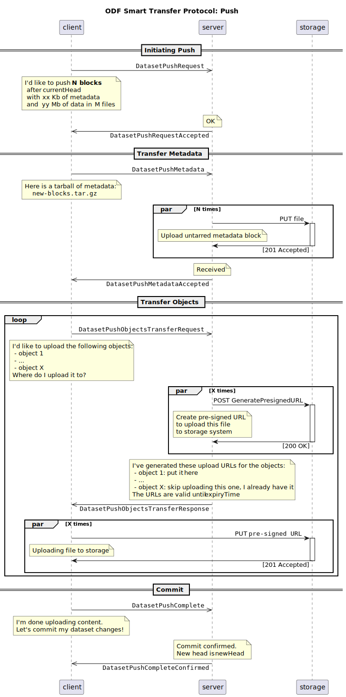
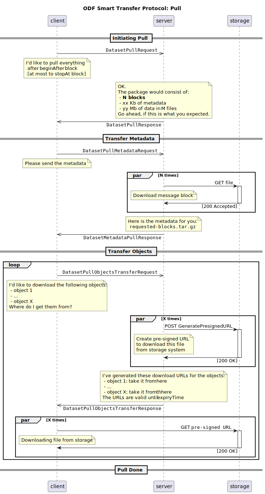

# RFC-008: Smart Transfer Protocol

**Start Date**: 2022-12-23

## Summary

An enhanced read/write transfer protocol that can be used to efficiently synchronize remote dataset repositories.

## Motivation

The performance limitations of the [Simple Transfer Protocol](./007-simple-transfer-protocol.md) are significant:
- the exchange becomes noticeably slow on datasets with >200 files, there is no use of batching, compression
- proxied push/pull are not allowed (being able to read/write directly from/to S3 instead of overloading the servers)

Another limitation this protocol is trying to address is that HTTP-based dataset sharing should not be read-only.

## Guide-level explanation

The protocol assumes establishing a duplex asynchronous communication channel between the parties.

A separate session of message exchanges is open for a single pull or push operation, 
and it is closed automatically after the intended operation is complete or fails with an error.

For a `pull` operation:
- Client initiates the request to the Server, sending the ID of the dataset and a desired block range
- Server responds by sending a tarball of metadata that matches the requested block range
- Client analyzes the received blocks and identifiers missing object files (such as data slices, checkpoints)
- Client negotiates with the Server on the download method for a subset or full set of missing object files:
   - for each object file, Server creates a time-limited pre-signed download URL with read-only access the storage system
   - Client directly reads the objects files from the storage system via pre-signed URLs
   - the negotiation can repeat for another subset of missing object files
- Client commits the new synchronized blocks, and closes the operation

For a `push` operation:
- Client initiates the request to the Server, sending the ID of the dataset and a tarball of the new metadata blocks
- If Server does not detect a divergence in the metadata, it confirms the Client may proceed synchronizing objects
- Client negotiates with the Server on the upload method for a subset or full set of new object files:
   - for each object file, Server creates a time-limited pre-signed upload URL with write-only access to the storage system
   - Client directly uploads the object files to the storage system via pre-signed URLs
   - the negotiation can repeat for another subset of new object files
- Client informs the Server about completion of the objects synchronization
- Server verifies the required objects exist and attempts to commit the new metadata blocks
- In case of success, the Server confirms the commit succeeded, and closes the operation

The exchange of object files should be performed with delays and object sizes taken into account.
As the expiration time of pre-signed URLs is limited, in case of large bulks have to be exchanged,
the pre-signed URLs might expire before the actual transfer starts - in this case they need to be re-requested.

The parallelism of the object download/upload operations to/from storage system is not limited by the protocol,
neither is to be constrained by the server. It's considered to be an implementation detail of the Client.

In case of errors, timeouts, the Client needs to re-initiate the operation with the Server by opening another session.
New operation may skip the synchronization of the already processed object files from the previous sessions, 
even if the changes have not been finally committed to the metadata. Cleaning orphan files that accumulate on transfer errors
is a subject for a separate Garbage Collector mechanism within the dataset storage, that is out of the scope of this RFC.

The protocol can be implemented using [WebSockets](https://websockets.spec.whatwg.org//) or any other 
alternative type of channel that supports bi-directional non-blocking message exchanges.

## Reference-level explanation

See `AsyncAPI` [description of the protocol messages](../swagger/smart_transfer_protocol_ws.yaml).

### Push flow

### Pull flow

## Drawbacks

## Rationale and alternatives

## Prior art

- [Git's "Smart Protocol"](https://git-scm.com/book/en/v2/Git-Internals-Transfer-Protocols)

## Unresolved questions
- Garbage Collector mechanism within the dataset storage

## Future possibilities

## Unstructured original notes

***

We need a protocol that most efficiently transfers all kinds of components:
 - for metadata - no alternative other than git
 - for the data of materialized datasets - this is the transport of parquet files (deltasharing solves this)
 - for view data / query results -  this is streaming of the date frames themselves (possibly Apache Arrow streaming)
- for checkpoints - file by file (it is possible to reuse deltasharing)
In addition, it should still work in a bulk access mode (download once) and with streaming (subscribe and listen like kafka).

***

Ideally it should be possible to unify data sources:
 - how is pull different from "load dataset to PowerBi" ?
 - maybe it does not need checkpoints and metadata
 - but data should be transferred, preferably without proxying S3

In reverse direction, in case of push - the data should be sent in-band, this makes it assymetric

***

Notes on deltasharing protocol:
- Good parts:
  - Simple - can easily support this protocol if needed
  - Choice of application/x-ndjson encoding
  - human-readable
  - easy to parse
  - self-delimiting
  - efficient for streaming / iterative production and consumption
    BUT: can Swagger / OpenAPI support it??

- Bad parts:
  - Very "egocentric" - designed mostly just with Databricks' own case in mind
  - Uses Spark-specific schema format - not even parquet, which would be a much better lower-level abstraction
  - Using "SQL subset" for predicate hints (pre-filters)
  - Change Data Feed API is Delta Lake specific
  - Even leaks the format of CDF files that show INSERT/UPDATE/DELETE/MERGE operations
  - Forces share/schema/table hierarchy upon server which is unnecessary

***

In smart protocol all phases, which are present in the SimpleTransferProtocol, are still present.
However, they are executed as operations solely on receiving/transmitting sides:
 - CompareChains phase - after this one we know exactly how many blocks would be transfered
 - Transfer phase - needs to negotiate how exactly source & destination wants to send/receive individual objects

A couple transfer options are:
 - simplified way:
    - we always send blocks in-band via a large TARball
    - data/checkpoints always as URLs - where to read from / where to write to
 - or more flexible way, where we could control transfer method for each object
    - it's especially interesting in the streaming context: use the same protocol for "continous pull"
    - in query context: instead of lastSeen/head sending filter or query, and streaming resulting data with the same protocol

Push/Pull operations data and checkpoints should be directly read/written from/to S3.
In-band data transfer is acceptable for queries only, when the query result cannot be directly satisfied from an existing file.
I.ex in our Data tab, or when you want to process the dataset in Jupyter, without enforcing local preliminary synchronization.

It's possible that these are 2 different protocols, although they solve similar problems.

Current implementation won't work, but Spark, Flink, maybe even DataFusion, should be able to use S3 directly.
We would only need to build a list of Parquet files for these tools taking metadata into account, 
and then look for the upload method (i.e, with column evolution taken into account).

***

Some notes on initial API draft:
 - I think separating endpoints by blocks, checkpoints, data-slices, the protocol becomes ineffecient.
   Each of these operations would require the backend to re-iterate the metadata chain initially.
 - I assumed it more like a big operation:
    - client:
      - I'd like to pull everything starting from block X
    - server:
      - Ok
      - Wait for N blocks, M data blocks, P checkpoints
      - Here is tar.gz of N blocks
      - Here is URL for file 1
      - Here is URL for file M
 - Push is harder:
    - preferably:
        - coordinate on push
        - send blocks
        - obtain presigned URLs for data/checkpoint files
        - push files directly to S3
        - say "you can commit now" to the server
    - it badly aligns with REST API:
        - we'll either have to keep state of long-running flow and create endpoints per each phase
        - or open a web-socket and perform a duplex coordination

More on paths:
 - I'm making `git clone https://github.com/open-data-fabric/open-data-fabric.git`
 - Smart Git protocol server does not get `GET open-data-fabric/open-data-fabric.git/head` (let's assume they have head endpoint)
 - while GitHub server obtains `GET open-data-fabric/open-data-fabric.git/head` and sends it as `GET <prefix>/head` to Git server

What I mean here:
 - let's describe the protocol at the individual dataset level
 - how exactly the dataset is addressed, whether it is `(dataset/{datasetID}/` or `{account_name}/{dataset_name})` 
    these are platform's implementation details, it should not be a part of ODF specification
 - I would prefer to pull the dataset like this:
    `kamu pull odf+https://kamu.dev/sergiimk/finance`
   This URL is nice, and `odf+https` scheme (similar to `s3+https` that we use for Minio) can be used to point this is a base-URL for smart transfer protocol

***

What do you think of pull & push to be implemented as websocket from the start?
Pull can live without it in theory, but it seems too complex for push without it.
Let's assume we are pushing a dataset of ~1M blocks and ~5K files for the first time.
If server returns pre-signed URLs for each data file, they might get expired before client even starts the transfer.

It's also preferable to support "resume", if the processed crashed in the middle.
It's of course clear that the server would not commit, obviously, but it could keep the already transfered files or a while.
When attempting to transfer once again - it could say "I already have this file, let's skip the transfer".

As an option:
 - push operation can be done in-band completely (without pre-signed URLs)
 - that way it can be a mirror copy of pull algorithm as described above, but with data instead of URLs.
 - if we decide to use web-sockets, we can think of an extension point in the protocol how to support the out-of-band uploads, thus trading resource capacity for development time.

***

A possible option is a long-running workflow.
It could store the state of the workflow in the database.
This would give us Resume, minimially, by 1 file.
This also allows a compensating rollback in case of cancellation / long timeout, where already loaded files could be deleted.
We could detect the file was uploaded using S3 webhooks, which could signal via SQS or make a lambda invokation.
The handler could locate the workflow stage record based on the bucket URL that is known beforehand, and mark the item as completed.
If collected all markrs - your push sequence is ready, server may commit the new block.

Web-socket is only a transportation mechanism, it's importa to have a recoverable state of the started operation one way or another.
As each side may crash during transaction, also the backend would likely be clusterized at some point, the state should not be in the server's temporary memory. It could be a database or distributed key-value store instead.

An interesting note: what should be done with parallel pushes to the same dataset?
Likely a simple optimistic locking would help, new block knows the previous one when initiating the scenario.
If head changed at commit point, the workflow fails completely.

With regards to secondary file transfers - those can be identified by a hash-function before the transfer.
The main risk is to accumulate large amount of garbage, in case the files are not associated with a particular workflow.

***

Yes, push in the REST-api style would demand a long-running workflow, and this creates a lot of complexity.
A lot of endpoints, keeping the state in the database, ...
With web-socket the transfer could become a single operation, which keeps the entire state in the backend's memory.
This is a simpler implementation, nothing is written to the DB.
With async long running web-socket we should not hurt backend performance signifficantly.
Intuitively I think this is easlier and much more flexible.

If push writes all files directly in a sequence:
 - backend accepts Tarball of blocks, and writes those to S3
 - client receives pre-signed URLs and writes data and checkpoints
 - at the very end: optimistic Compare-and-Swap of the head reference
 - it should be easy to support resume too (? strict sequence)
 
Key problems:
 - how to find out whether the file is completely transfered, and did not fail in the middle of writing
    (should hopefully be solvable in S3)
 - orphaned files
    - if client failed and did not finish the push
    - if late collision happens

Orphans can be skipped for now.
Initially we can avoid GC and collect orphans for a while.
Then make a cleanup command for the dataset, that would delete files that are not referenceable from head.
Finally, making a smarter push, i.e., tracking temporary state on the backend,
 and cleaning unfinished operations quickly without scanning the entire chain.

Although, we should not be strongly dependent on AWS-specific features!

***

For the smart protocol, deciding between REST vs duplex channel is the most critical choice we need to make.
We need to understand push flow, other parts should be simpler:
 - how to send object in-band
 - how to effeciently send a bulk of little objects
 - how to send object out-of-band (by URL)
 - how to "commit"
