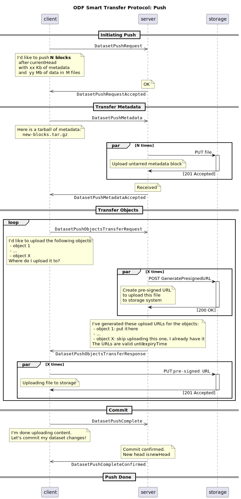

# RFC-008: Smart Transfer Protocol

**Start Date**: 2022-12-23

## Summary

An enhanced read/write transfer protocol that can be used to efficiently synchronize remote dataset repositories.

## Motivation

The performance limitations of the [Simple Transfer Protocol](./007-simple-transfer-protocol.md) are significant:
- the exchange becomes noticeably slow on datasets with >200 files, there is no use of batching, compression
- proxied push/pull are not allowed (being able to read/write directly from/to S3 instead of overloading the servers)

Another limitation this protocol is trying to address is that HTTP-based dataset sharing should not be read-only.

## Guide-level explanation

The protocol assumes establishing a duplex asynchronous communication channel between the parties.

A separate session of message exchanges is open for a single pull or push operation, 
and it is closed automatically after the intended operation is complete or fails with an error.

For a `pull` operation:
- Client initiates the request to the Server, sending the ID of the dataset and a desired block range
- Server responds by sending a tarball of metadata that matches the requested block range
- Client analyzes the received blocks and identifiers missing object files (such as data slices, checkpoints)
- Client negotiates with the Server on the download method for a subset or full set of missing object files:
   - for each object file, Server creates a time-limited pre-signed download URL with read-only access the storage system
   - Client directly reads the objects files from the storage system via pre-signed URLs
   - the negotiation can repeat for another subset of missing object files
- Client commits the new synchronized blocks, and closes the operation

For a `push` operation:
- Client initiates the request to the Server, sending the ID of the dataset and a tarball of the new metadata blocks
- If Server does not detect a divergence in the metadata, it confirms the Client may proceed synchronizing objects
- Client negotiates with the Server on the upload method for a subset or full set of new object files:
   - for each object file, Server creates a time-limited pre-signed upload URL with write-only access to the storage system
   - Client directly uploads the object files to the storage system via pre-signed URLs
   - the negotiation can repeat for another subset of new object files
- Client informs the Server about completion of the objects synchronization
- Server verifies the required objects exist and attempts to commit the new metadata blocks
- In case of success, the Server confirms the commit succeeded, and closes the operation

The exchange of object files should be performed with delays and object sizes taken into account.
As the expiration time of pre-signed URLs is limited, in case of large bulks have to be exchanged,
the pre-signed URLs might expire before the actual transfer starts - in this case they need to be re-requested.

The parallelism of the object download/upload operations to/from storage system is not limited by the protocol,
neither is to be constrained by the server. It's considered to be an implementation detail of the Client.

In case of errors, timeouts, the Client needs to re-initiate the operation with the Server by opening another session.
New operation may skip the synchronization of the already processed object files from the previous sessions, 
even if the changes have not been finally committed to the metadata. Cleaning orphan files that accumulate on transfer errors
is a subject for a separate Garbage Collector mechanism within the dataset storage, that is out of the scope of this RFC.

The protocol can be implemented using [WebSockets](https://websockets.spec.whatwg.org//) or any other 
alternative type of channel that supports bi-directional non-blocking message exchanges.

## Reference-level explanation

Smart Transfer Protocol defines 2 kinds of APIs:
 - `OpenAPI` [description of the initial REST endpoints](../protocols/smart-transfer-protocol.openapi.yaml).
 - `AsyncAPI` [description of the protocol messages](../protocols/smart-transfer-protocol.asyncapi.yaml).

`OpenAPI` is a superset of REST API endpoints as defined in the 
[Simple Transfer Protocol](./007-simple-transfer-protocol.md), with extensions to establish 
asynchronous duplex messaging channel as defined by `AsyncAPI`.

### Push flow

### Pull flow

## Drawbacks

- Ended up with a custom protocol rather than reusing some standard
- Asynchronous duplex messaging APIs are harder to test

## Alternatives

- Considered implementing the protocol in the form of synchronous request-response REST API:
   - Good parts:
     - Better portability (although, not really relevant in 2023 by now)
     - Easier to test the implementations
   - Bad parts:
     - Requires modeling push flows as a long-running operation with the state stored in the DB
     - More complex state recovery logic in case of resume/cancellation
     - Potential re-iteration over the same metadata chain, as messages get split between independent stateless calls
   - Decision:
     - Refused in favor of asynchronous bi-directional messaging API

## Prior art

- [Git's "Smart Protocol"](https://git-scm.com/book/en/v2/Git-Internals-Transfer-Protocols)

- [DeltaSharing](https://github.com/delta-io/delta-sharing/blob/main/PROTOCOL.md):
   - Good parts:
     - Simple - can easily support this protocol if needed
     - Choice of [application/x-ndjson] (https://github.com/ndjson/ndjson-spec) encoding
     - human-readable
     - easy to parse
     - self-delimiting
     - efficient for streaming / iterative production and consumption
   - Bad parts:
     - Very "egocentric" - designed mostly just with Databricks' own case in mind
     - Uses Spark-specific schema format - not even Parquet, which would be a much better lower-level abstraction
     - Using "SQL subset" for predicate hints (pre-filters)
     - Change Data Feed API is Delta Lake specific
     - Leaks the format of CDF files that show INSERT/UPDATE/DELETE/MERGE operations
     - Forces share/schema/table hierarchy upon server which is unnecessary

## Unresolved questions
- Garbage Collector mechanism within the dataset storage, as orphaned files may occur:
   - when client failed to upload the objects and did not commit the push
   - when late collision happens (parallel pushes)
- Should this protocol support live streaming of datasets?
- Should it support in-band data transfers?
  - And if yes, should it be used for query results or for getting data from projections?

## Future possibilities

- DeltaSharing can be implemented as a separate protocol reusing a lot of the parts from this
- A detection of unfinished pushes can be added to clean up orphaned files without doing a full GC run on a dataset
