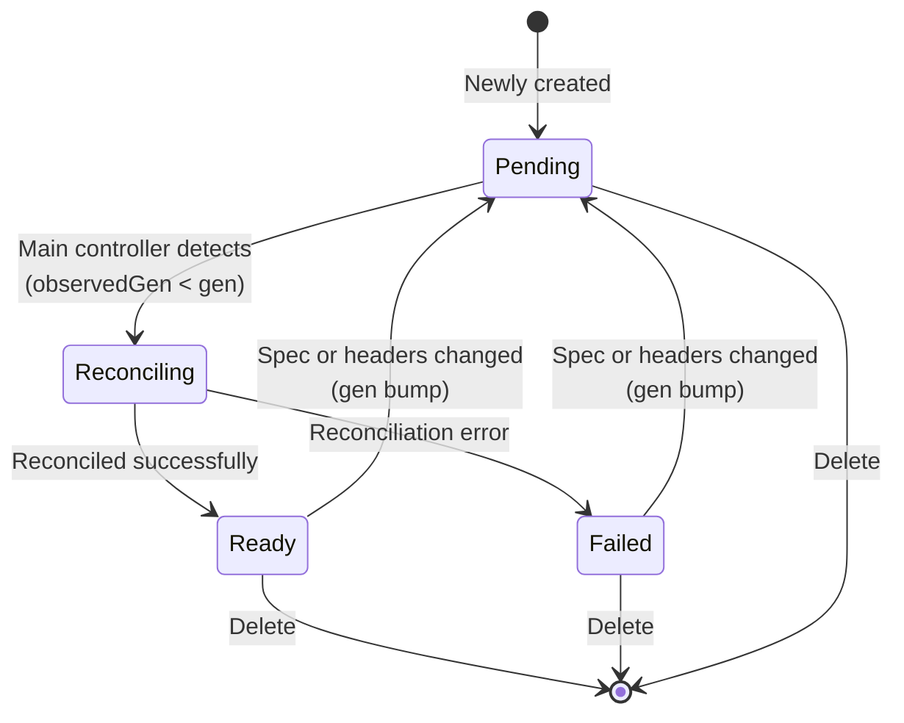

# RFC-018: Infrastructure-as-Code Resource Framework <!-- omit in toc -->

[](https://github.com/kamu-data/open-data-fabric/pull/126)

**Start Date**: 2025-06-14

**Published Date**: 2026-06-28

**Authors**:
- [Sergiy Zaychenko](mailto:sergiy.zaychenko@kamu.dev), [Kamu](https://kamu.dev)
- [Sergii Mikhtoniuk](mailto:smikhtoniuk@kamu.dev), [Kamu](https://kamu.dev)


**Compatibility**:
- [X] Backwards-compatible
- [ ] Forwards-compatible


## Summary <!-- omit in toc -->
This RFC proposes a new Open Data Fabric manifest format and a set of resource types aiming to re-center ODF around the declarative approach for defining the desired state of the system, achieve better functional decomposition of the system, and provide a better framework for extensibility.

## Table of Contents <!-- omit in toc -->

- [Motivation](#motivation)
- [General Direction](#general-direction)
- [Terminology](#terminology)
- [Proposal](#proposal)
  - [Resource Manifests](#resource-manifests)
    - [Type Identification](#type-identification)
    - [Versioning](#versioning)
    - [Multi-tenancy](#multi-tenancy)
    - [Identity](#identity)
      - [IDs vs. DIDs](#ids-vs-dids)
    - [Labels \& Annotations](#labels--annotations)
    - [References](#references)
    - [Typed References](#typed-references)
    - [Reference resolution](#reference-resolution)
    - [Selectors](#selectors)
    - [Ownership](#ownership)
    - [Generations](#generations)
    - [Status](#status)
  - [Resource Application](#resource-application)
  - [APIs](#apis)
    - [Current state of ODF APIs](#current-state-of-odf-apis)
    - [REST API strategy](#rest-api-strategy)
    - [GraphQL strategy](#graphql-strategy)
- [Compatibility](#compatibility)
- [Prior art](#prior-art)
  - [Kubernetes Design Notes](#kubernetes-design-notes)
    - [Kubernetes API Overview](#kubernetes-api-overview)
- [Rationale and alternatives](#rationale-and-alternatives)
  - [ODF objects as Kubernetes CRDs](#odf-objects-as-kubernetes-crds)
  - [Terraform modules for ODF API](#terraform-modules-for-odf-api)
- [Unresolved questions](#unresolved-questions)
- [Future possibilities](#future-possibilities)
  - [JSON-LD](#json-ld)
  - [Extensibility of union types](#extensibility-of-union-types)
- [Appendix A: Example Manifests](#appendix-a-example-manifests)


# Motivation
1. 
   Open Data Fabric spec started and revolved around the single `DatasetSnapshot` manifest that defines the desired state of dataset metadata. We have used `MetadataEvent` types in the snapshot type to define quite complex features like polling data ingestion and push sources.
   
   With gained experience, we started to realize that some of these features don’t belong in dataset metadata as they not only don’t contribute to dataset provenance or validity, but may **reveal sensitive information about publisher’s infrastructure** that must remain private. This RFC proposes to move some of this information out of the dataset metadata chain to be kept private and at the same time **make core ODF format spec more lean** and easier to adopt.

2. 
   Reference implementations like Kamu have been adding a lot of new features that are strongly related to reusable data pipelines but clearly don’t belong in the dataset metadata:

   * Flow schedules and configuration  
   * Dataset variables and secrets  
   * ReBAC permissions

   Because it didn’t make sense to encode these into metadata events, configuration started relying on the growing amount of custom GQL and REST APIs **sidetracking us into imperative configuration**, while ODF’s intention was always to be maximally declarative. This makes configuring the state of the system significantly more challenging, and makes configuration process **non-portable** between ODF implementations.
   
   With this RFC we want to provide all ODF implementations a single resource configuration framework with a clear way to upstream established resources later into ODF, and correct the course back towards the **declarative Infrastructure-as-Code approach**.


# General Direction
ODF is quickly becoming a ***“Kubernetes for Data”*** \- a high-level integration framework for different data formats, compute engines, privacy technologies, and data access APIs.

We are embracing **Infrastructure-as-Code** philosophy:

* Manifest files will be the primary way to instantiate and update all resources in data pipelines
* Configurations can be managed in git
* Configuration will describe "desired state" of the system
* Reconciliation mechanism will be responsible for matching actual state with the desired state

We introduce a **unified model of resource, identity, references, ownership**. We want to provide similar API experience whether you are configuring datasets, flows, variables, or ReBAC relations. We want representation to work similarly across different flavors of APIs (REST / GQL) to reduce maintenance burden - adding a new resource type should not require extending the API surface.


# Terminology
We will stick to the following terminology:

* **Resource** - is a managed back-end entity that has an identity and consumes or allocates some compute or storage resources
* **Manifest** - is a declarative configuration (e.g. a YAML file) that describes the desired resource state.  
* **Controller** - a process that keeps track of certain manifest types and reconciles them with the state of objects under its control. The purpose of controllers is to constantly move the current resource state towards the desired state described by manifests.

Examples:

* `Dataset` YAML file is a manifest applying which will create a corresponding `Dataset` resource  
* `VariableSet` is a high-level manifest applying which will create a set of `Variable` resources  
* `Ingress` is a manifest application of which will create a high-level `Ingress` resource. The controller of `Ingress` will then generate and apply lower-level manifests for `ApiEndpoint`, a `Buffer` (e.g. Kafka topic), and a `Source`, which will in turn result in provisioning of corresponding resources.

# Proposal
The proposal will often reference Kubernetes as one of the best examples of the declarative IaC approach. We will draw many parallels with its design and build on its learnings.


## Resource Manifests
In Kubernetes manifests are structured as:
```yaml
apiVersion: external-secrets.io/v1beta1
kind: SecretStore
metadata: {}
spec: {}
status: {}
```

In ODF we propose a format like this:
```yaml
$schema: https://opendatafabric.org/schemas/config/v1alpha1/SecretSet
headers: {}
spec: {}
status: {}
```

Here:
- `$schema` identifies the type of the resource using a resolvable URL that points to the JSON Schema file
  - This replaces separate `apiVersion`/`kind` fields (as in K8s) with a single self-describing identifier
- `headers` contains identity and ownership information
  - `headers` is used instead of `metadata` because the latter is already an overloaded term in ODF and is generic to the point of being meaningless
- `spec` defines the desired state of the resource
- `status` contains information about the current state and the reconciliation process


### Type Identification
We use `$schema` URL to identify resource types:

```yaml
$schema: https://opendatafabric.org/schemas/config/v1alpha1/SecretSet
```

The `$schema` URL is formatted as `{base-url}/{context}/{version}/{Name}` and carries:
- Controlling organization domain (e.g. `opendatafabric.org`)
- Bounded context (e.g. `config`)
- Version (e.g. `v1alpha1`)
- Resource name (e.g. `SecretSet`)

Many IDEs recognize `$schema` field and automatically fetch the associated JSON schema to provide validation and auto-completion.

Resource schemas will be registered within ODF node and, similarly to Kubernetes CRDs, assigned a **short type name** (e.g. `SecretSet`) that can be used instead of the schema. This concept is very similar to JSON-LD expansion.


### Versioning
Version is part of the `$schema` URL in the form of `v1` or `v1alpha1`.

- Version should NOT be thought of only as manifest schema. It captures both how resource is defined and the semantics of how it behaves, i.e. version may be incremented if resource behavior changes significantly even when the schema stays the same.
- Versions apply to the level of entire bounded context, not an individual resource, so if one domain contains multiple related resources a version bump would apply to all of them.


### Multi-tenancy
Resources can explicitly define which `account` they belong to:

```yaml
$schema: https://opendatafabric.org/schemas/config/v1alpha1/SecretSet
headers:
  account:
    name: alice
spec: {}
```

Or using a short form:

```yaml
account: alice  # Short form can parse UID, DID, or name
```

See [resource references](#references) for details about referring to accounts.

Unlike Kubernetes that uses RBAC and `namespace`-based isolation - ODF is based on **ReBAC account-centric model** that allows complex ownership and access control hierarchies, e.g. teams, organizations, flexible permissions for accounts outside of organizations.


### Identity
A manifest file will usually only define the `name`:

```yaml
$schema: https://opendatafabric.org/schemas/config/v1alpha1/SecretSet
headers:
  name: my-secrets
spec: {}
```

Note that resource **names are mutable** (unlike in Kubernetes).

At one point in time the tuple `(Account, ResourceType, ResourceName)` uniquely identifies a resource within an ODF node (see also [references](#references)). There may be multiple resources of different types under one account with the same name.

Upon resource creation ODF node will additionally assign resource a unique `id` (UUID v4):

```yaml
$schema: https://opendatafabric.org/schemas/config/v1alpha1/SecretSet
headers:
  id: 6767a4ee-d74d-436e-84f9-709407869a26
  name: my-secrets
spec: {}
status: {}
```

The `id` is a stable identifier of a resource **within one node**.

Including `id` in the manifest can be used to ensure the manifest applies to the exact needed resource, but sacrifices portability of the manifest across ODF nodes.

When including both `id` and `name` the identity matching will be performed by `id` while the `name` will be synchronized with the manifest, thus allowing you to **rename** resources.


#### IDs vs. DIDs
As resources describe the **desired state** of the system - resource instances are separate from objects that are created to fulfill that state. Thus e.g. a `Dataset` resource is not the same thing as an ODF dataset stored in some S3 bucket. `Dataset` resource can be used to create or configure an ODF dataset, but they are separate objects.

This is why resources like `Dataset` or `Account` have both:
- `id` (UUIDv4) that identifies the resource within a node
- and a `did` (W3C DID) that identifies an ODF dataset or a person on a global network

When one ODF node populates an ODF dataset with `did:odf:xxyy` and another node replicates this dataset - they will have two `Dataset` resources with the same `did` but different `id`.

Since DIDs are unique, reference types support **identifying target resources by DIDs of the corresponding objects**, purely for convenience.


### Labels & Annotations
Resources can specify custom labels and annotations. Both are maps of string keys to any JSON values, but only labels get indexed and can be used for querying:

```yaml
$schema: https://opendatafabric.org/schemas/config/v1alpha1/SecretSet
headers:
  name: my-secrets
  labels:
    env: prod
  annotations:
    owner: https://github.com/open-data-fabric
    repo: https://github.com/open-data-fabric/spec
spec: {}
```

Labels and annotations are fully **mutable**.

Label and annotation keys can be either short type names or full URIs:

```yaml
```yaml
$schema: https://opendatafabric.org/schemas/config/v1alpha1/Dataset
headers:
  name: my-dataset
  labels:
    # Resolves to https://opendatafabric.org/schemas/dataset/v1alpha1/DatasetKind
    # Anything but Root or Derivative will fail valiation
    datasetKind: Root
    did: did:odf:aa..bb
  annotations:
    # Expanded form
    https://opendatafabric.org/schemas/labels/v1/Repo: https://github.com/open-data-fabric/spec
spec:
  kind: Root
  metadata: []
```

Thus every label and annotation has a schema and can be type-checked.

Controllers may contribute their own labels to simplify common filtering scenarios. For example a `Dataset` resource above will automatically get the `datasetKind: Root` label without you needing to specify it manually because it's very common to filter datasets by `datasetKind`.


### References
Resource manifests can link to other resources using **references**, forming a DAG.

Resources can be referenced by:
- ID (unique within a node)
- DID (unique globlly)
- Type, name, and the (optional) owning account
  - When account is not specified the name is resolved within the current account (auth subject)

Example of referencing a `PersistentVolume` by name and owning account:

```yaml
$schema: https://opendatafabric.org/schemas/dataset/v1alpha1/Dataset
headers:
  name: my-dataset
spec:
  metadata: []
  volume:
    type: PersistentVolume
    name: my-s3-bucket
    account:
      name: my-org
```

Or in short form:
```yaml
volume: PersistentVolume:my-org/my-s3-bucket
```

Example of referencing by ID:

```yaml
volume:
  type: PersistentVolume
  id: 6767a4ee-d74d-436e-84f9-709407869a26
```

Example of referencing by DID:

```yaml
account:
  type: Account
  did: did:odf:0xfa..bc
```

Cyclical references are not allowed - this can be enforced by implementations via linters.

Unlike Kubernetes that doesn't specify a common reference format - in ODF all references and selectors will have a common schema and thus can be easily picked up by linters and other automation uniformly, without knowing the specifics of individual resource schemas.


### Typed References
Many contexts may choose to provide extended versions of resource references that:
- Restrict target resources to a specific type (e.g. `DatasetRef`, `VolumeRef`)
- Provide additional features (e.g. ability to reference a sub-path of a secret via `Secret:postgres#password`)


### Reference resolution
When setting up complex resource graphs like ingestion pipelines it's very convenient to reference all components by names, especially when target resources are not created yet and were not assigned an `id`.

When operating complex graphs long-term, however, as resources get renamed and deleted referencing by name may not only become a nuisance, but cause security risks if old names get reused.

This is why ODF nodes will resolve all references to stable IDs upon first apply, while account and name information will remain for annotational purposes:

```yaml
volume:
  id: 6767a4ee-d74d-436e-84f9-709407869a26  # Stable reference
  type: PersistentVolume
  name: my-s3-bucket  # Remains only for human readability
  account:
    name: my-org
```

**Dangling references are allowed** - it's up to implementations to warn users about such situations, but:
- It should be possible to create e.g. a `Source` that references a non-existing `Secret` and have it created later
- It should be possible to delete a resource referenced by others


### Selectors
Multiple resources can be referenced at once with **selectors**.

Resources can be referenced in bulk by shared properties like:
- Name patterns
- Label filters

```yaml
$schema: https://opendatafabric.org/schemas/flow/v1alpha1/Flow
headers:
  name: periodic-compaction
spec:
  target:
    type: Dataset
    name: org.opendatafabric.%
    labels:
      datasetKind: Root
      env: prod
  triggers:
    - kind: Cron
      cron: "@daily"
  steps:
    - kind: Compaction
      maxSliceSize: 100MiB
      maxSliceRecords: 10_000
```

Note that, unlike references, selectors are not resolved to IDs, so if some resource stops matching the pattern after a rename or a change of label - it will not be tracked by the selector.


### Ownership
When an object is created by another higher-level object it can write the association into the header as `ownerReference`. This creation provenance trail can be used for automatic cascading deletion and garbage collection.

```yaml
$schema: https://opendatafabric.org/schemas/source/v1alpha1/Buffer
headers:
  name: buffer-aabbcc
  ownerReferences:
  - id: c27331ce-ce88-4ff9-8c5a-4ce8107cc03f
    name: ingest-f76666445
spec: {}
```

See also:
- [Kubernetes Owners and Dependents](https://kubernetes.io/docs/concepts/overview/working-with-objects/owners-dependents/)


### Generations
Resource reconciliation is an **eventually-consistent** process. While a controller is working to reconcile one version of a resource the desired state may be changed by the user. To reflect this lag, a sequential `generation` number is incremented every time the resource header and spec are updated.

```yaml
$schema: https://opendatafabric.org/schemas/config/v1alpha1/SecretSet
headers:
  name: my-secrets
  generation: 4
  createdAt: 2026-01-01T00:00:00Z
  updatedAt: 2026-01-04T00:00:00Z
spec: {}
status: {}
```

In the `status` section `observedGeneration` can be used to see what generation the controller had a chance to process.

Note that `generation` does not increment on status changes as it is intended to signify changes to the desired state.


### Status
The `status` section of the resource manifest never appears in user-defined manifests. It is maintained by the ODF nodes and writeable only by resource controllers. It is used to provide detailed information about the reconciliation status of the resource.

The main controller of a resource populates the `phase` and associated top-level fields during reconciliation attempts, while the `conditions` field provides a generic mechanism to attach additional information like error codes and messages. The `conditions` can be contributed by multiple controllers.

Example of `Source` resource status where reconciliation attempt for `generation: 2` failed because it links to non-existing secret:
```yaml
$schema: https://opendatafabric.org/schemas/source/v1/Source
headers:
  name: api-polling-source
  generation: 2
spec: {}
status:
  phase: Failed 
  observedGeneration: 2
  updatedAt: 2026-01-02T00:00:00Z
  conditions:
    https://opendatafabric.org/schemas/source/v1/SourceReconciliationError:
      code: unresolved-reference
      message: "Secret `new-api-key` not found"
      updatedAt: 2026-01-02T00:00:00Z
      observedGeneration: 2
```

The `phase` field state machine:



The `conditions` are keyed by schema IDs to disambiguate, avoid name collisions, and provide schema checking.


## Resource Application
When applying manifests the following steps take place:
1. Load each manifest in apply batch and validate against its schema
2. Lookup if target resources already exist (by `id` or `name`)
3. Assign `id`s to resources that do not yet exist
4. Resolve all resource references to `id`s of existing resources or those about to be created
5. Reorder resources in depth-first dependency order
6. Pass every resource into `pre-apply` step of its corresponding main controller to:
   1. Perform additional validation
   2. Contribute additional labels (e.g. `datasetKind`)
   3. Re-write parts of the spec (e.g. to encrypt raw secrets into `jwe` before the spec is stored)
7. Resource `generation` is incremented
8. Resource specs are saved into the event store
9. Reconciliation process is initiated asynchronously

## APIs

### Current state of ODF APIs
Current API of the Node evolved as several groups of functionality:

- REST API is composed of semi-overlapping groups like:  
  - Simple transfer protocol  
  - Smart transfer protocol  
  - Data query and commitments  
- Standalone APIs 
  - GraphQL
  - FlightSQL


Our REST API is currently missing the functionality for listing datasets, inspecting metadata, and manipulating other objects like accounts, flows, variables etc - this role is only filled by GraphQL.

As we evolve our APIs we would like:

- REST API to become a superset of GraphQL API  
- Minimize the burden of maintaining two APIs (reuse object schemas as much as possible)  
- Establish a good versioning strategy


### REST API strategy
We will introduce another core REST API protocol group: **Resource protocol**.


Resource protocol will define:
* How to list, create, update, delete, and get the state of various resources in an ODF system  
* Top-level **resource addressing scheme** and serve as a **nesting point** for other protocols like simple/smart transfer and data querying

Proposed protocol endpoint scheme:
* The account acted upon by the auth subject will be reflected in `account` query argument:
  * no argument - same as `?account=`
  * `?account=` - use account from the auth token
  * `?account=opendatafabric.org` - specifies account by name
  * `?account=did:key:...` - specifies account by DID
* Listing: `/<context>/<version>/<type>`  
  * `/dataset/v1/dataset`  
  * `/auth/v1/relation`  
* By object ref: `/<context>/<version>/<type>/<id-did-name>`  
  * `/config/v1/secret/c27331ce-ce88-4ff9-8c5a-4ce8107cc03f`  
  * `/dataset/v1/dataset/did:odf:123..321`
  * `/dataset/v1/dataset/my-dataset` (searches current account only)  
* Other HTTP-based protocols: `/<protocol>/...`  
  * `/graphql`


### GraphQL strategy
Initially GQL will cover only generic resource operations (apply, rename, delete etc.) while representing the resources as plain JSON scalars.

This approach avoids having a dynamic GQL schema for types that will be registered in ODF node in runtime.

In the future we will consider the benefits of representing ODF resource manifests as fully-featured types and reference graph navigation.

For example a manifest like this one:

```yaml
$schema: https://opendatafabric.org/schemas/dataset/v1alpha1/Dataset
headers:
  did: did:odf:123..321
  name: foo
  account: sergiimk
spec:
  volume: PersistentVolume:sergiimk/my-s3-bucket
```

Could allow navigation of references as:

```gql
datasets {
  byId(id: "did:odf:123..321") {
    spec {
      volume {  # reference becomes navigable
        id
        type
        name
        account {
          name
        }
      }
    }
  }
}
```


# Compatibility
Proposed changes can be introduced in implementations in parallel with existing mechanics, gradually adopting `Dataset` and `Source` resources as replacements for `DatasetSnapshot` and in-metadata polling and push sources.


# Prior art

## Kubernetes Design Notes
* [Generated Object API Reference](https://kubernetes.io/docs/reference/generated/kubernetes-api/v1.31/#api-overview)  
* OpenAPI Spec
  * [Schema link](https://raw.githubusercontent.com/kubernetes/kubernetes/refs/heads/master/api/openapi-spec/swagger.json)  
  * [OpenAPI Editor](https://editor-next.swagger.io/)  
* [apimachinery](https://github.com/kubernetes/apimachinery/blob/master/pkg/apis/meta/v1/types.go)  
* [Kubernetes API concepts](https://kubernetes.io/docs/reference/using-api/api-concepts/)  
* [kube.rs](http://kube.rs)  
* [https://github.com/Arnavion/k8s-openapi](https://github.com/Arnavion/k8s-openapi)  
* [Kubernetes API Groups](https://github.com/kubernetes/design-proposals-archive/blob/main/api-machinery/api-group.md) (api-based versioning instead of resource-based)

### Kubernetes API Overview

Kubernetes provides a unified API that is very extensible and provides a uniform way to work with all object resources.


Basic Kubernetes API scheme is:

* `/apis/<group>/<version>/<kind>/<name>`  
  * `/apis/apps/v1/deployments`  
  * `/apis/apps/v1/deployments/my-deployment`  
* `/apis/<group>/<version>/namespaces/<namespace>/<kind>/<name>`  
  * `/apis/apps/v1/namespaces/my-namespace/deployments/my-deployment`

Benefits of Kubernetes REST API:

* Proven, mature model  
* API-based versioning  
* API groups allowing different subsystems to evolve independently

Problems with Kubernetes REST API:

* Namespace is the only unit of multi-tenancy  
  * In ODF we aim for more flexible multi-tenancy model based on accounts 
* Objects are addressed by names \- it’s not possible to use `uid`  
  * The names in k8s are immutable, but in ODF they can not only be changed within a node, but also be different across nodes


# Rationale and alternatives

## ODF objects as Kubernetes CRDs
If we were to piggy-back on Kubernetes:
* Pros:
  * Mature system
  * Reusing tools and integrations  
* Cons:
  * We would inherit many legacy design choices
  * Namespaces and RBAC don’t provide real multi-tenancy  
    * We would like to think multi-tenant / multi-region /multi-cloud  
    * See [https://www.kcp.io/](https://www.kcp.io/)  
  * Performance concerns in case of millions of objects  
  * Excessive coupling that would be hard to undo  

Building our own resource system:
* Pros:
  * More flexibility
  * Can natively support ReBAC and our vision of multi-tenancy
  * Can freely evolve manifest formats to make them easier to author
* Cons:
  * A lot more work
  * Templating would require re-inventing something like helm \+ helmfile


## Terraform modules for ODF API
* Pros:
  * Can wrap existing APIs in TF modules without modifications  
  * Existing tool for complex dependency management and templating  
* Cons:
  * TF feels like a hack to add declarativeness onto services that don’t support it  
  * Very few data engineers have TF experience  
  * High potential for desync between TF state and actual pipeline state  
  * TF state needs to be stored somewhere, requiring more infrastructure on the user’s side  
  * Harder to validate and to report useful errors


# Unresolved questions
- DatasetID vs ResourceID
  - should we have both?
  - two types of selectors then?


# Future possibilities

## JSON-LD
We are [considering using JSON-LD](https://github.com/open-data-fabric/open-data-fabric/issues/123) for manifests in future. JSON-LD manifest could look like this:

```yaml
"@context": https://opendatafabric.org/core/v1/context.jsonld
"@type": config:SecretSet
"@id": https://cluster.example.com/resources/8f3b2c1a-4d5e-6f7a-8b9c-0d1e2f3a4b5c
headers: {}
spec: {}
status: {}
```

They would provide a standard URI expansion/collapsing mechanism for types and may help with flexible versioning of schema fields.


## Extensibility of union types
Some union types like `TaskSpec` and `Ingress` currently provide a fixed set of variants. This is very convenient for manifest auto-completion, but will restrict implementation from experimenting with other types of tasks and sources.

We should in the future extend those types with an `Ext` variant that allows specifying fully generic values, e.g.:
```yaml
tasks:
- kind: Ext
  $schema: https://kamu.dev/schemas/v1/AwesomeTask
  makeEverythingAwesome: true
```


# Appendix A: Example Manifests
Example resource manifests are provided with this RFC in the [`/examples`](/examples) directory.

An [entity-relationship diagram](/schemas-generated/mermaid/erd.svg) is also available to see the interplay of core prototype types.

Note that many resource types are still in **early prototype stage** of maturity and will be refined during the reference implementation.
